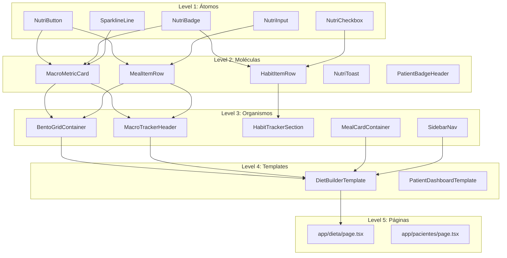
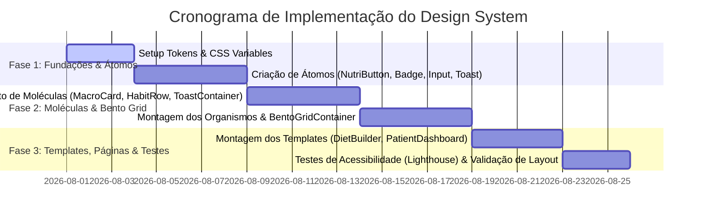

# PRD: Design System NutriDiet Local Pro

> **Documento de Requisitos de Produto (PRD) para o Design System NutriDiet Local Pro**  
> **Status**: Aprovado / Especificação de Produção  
> **Arquitetura Base**: Atomic Design (Brad Frost - Cap. 2) + Swiss Warm Minimalist Flat Design + Shadcn UI Extension  
> **Fontes de Referência UI**: [ref-habit-tracker.png](file:///c:/Programmer/diet-maker/refs/UI/ref-habit-tracker.png), [ref-kucoin-dashboard.png](file:///c:/Programmer/diet-maker/refs/UI/ref-kucoin-dashboard.png), [ref-shadcn-bento.png](file:///c:/Programmer/diet-maker/refs/UI/ref-shadcn-bento.png), [ref-toast-notifications.png](file:///c:/Programmer/diet-maker/refs/UI/ref-toast-notifications.png)

---

## 1. Executive Summary (Sumário Executivo)

### 1.1 Problem Statement (Declaração do Problema)
Nutricionistas clínicas e seus pacientes enfrentam o desafio constante de gerenciar planos alimentares complexos, metas nutricionais dinâmicas, rastreamento de hábitos e suplementação através de interfaces sobrecarregadas, genéricas ou pouco intuitivas. Interfaces de nutrição tradicionais frequentemente falham em apresentar alta densidade de dados (macronutrientes, micronutrientes, distribuição por refeição, balanço hídrico) sem causar poluição visual ou fadiga cognitiva no usuário.

### 1.2 Proposed Solution (Solução Proposta)
O **NutriDiet Design System** é uma linguagem de design unificada e arquitetura de componentes de alta fidelidade para o **NutriDiet Local Pro**. O sistema é derivado da análise sintética e fusão estratégica de 4 padrões visuais de nível mundial:

1. **Arquitetura Bento Grid Modulares (`ref-shadcn-bento.png`)**: Organização de informações heterogêneas (macros, metas, gráficos de tendência, listas de refeições) em contêineres limpos e modulares com aproveitamento de espaço máximo.
2. **Dashboard de Alta Densidade e Sparklines (`ref-kucoin-dashboard.png`)**: Visualização direta de métricas chave de progresso (evolução de peso, consumo de proteína/carboidrato/gordura) via mini gráficos de tendência vetoriais e tabelas compactas de dados.
3. **Rastreamento de Hábitos e Categorização por Badges (`ref-habit-tracker.png`)**: Micro-interações de checklist, filtros de categorias com contadores numéricos e cartões intuitivos para suplementação e rotinas diárias (manhã/noite).
4. **Sistema Flutuante de Toasts Semânticos (`ref-toast-notifications.png`)**: Feedback de sistema elegantemente destacado com cartões flutuantes, ícones circulares em fundos pastel semânticos (Sucesso, Aviso, Erro, Informação) e contornos 1px refinados.

O sistema adota estritamente o **Swiss Warm Minimalist Flat Design** (`#f5f2eb` creme como fundo, `#ffffff` para cartões, contornos de 1px sólidos `#e8e4dc`, zero sombras 3D e zero gradientes).

### 1.3 Success Criteria (Critérios de Sucesso)
* **Arquitetura Atomic Design**: 100% de conformidade com os 5 níveis de componentes (`atoms`, `molecules`, `organisms`, `templates`, `src/app`).
* **Preservação do Shadcn UI**: Manutenção intocada da pasta `src/components/ui/` e criação exclusiva de componentes filhos especializados para regras de negócio.
* **Acessibilidade e Desempenho**:
  * Score de 100% no Lighthouse Accessibility.
  * Razão de contraste de texto WCAG 2.1 AA/AAA (mínimo de 4.5:1 para texto secundário e 7:1 para corpo principal).
  * Tempo de resposta tátil e interativo < 100ms.
* **Disciplinas de Design Invioláveis**:
  * Zero uso de emojis como ícones (substituição total por **Lucide-React** SVG).
  * Zero `box-shadow` e zero `background-image` gradiente (estilo Swiss Flat estrito).

---

## 2. Análise Detalhada das Referências de UI & Interpretação de Design

| Arquivo de Referência | Estética & Padrões Visuais Identificados | Interpretação & Aplicação no NutriDiet Local Pro |
| :--- | :--- | :--- |
| **`ref-habit-tracker.png`** | • Categorias filtráveis em pill badges com contadores `Categoria (N)`.<br>• Cards de hábitos com ícone circular minimalista + metadados de tempo/dificuldade.<br>• Bloco de Rotina dividido em colunas (`Morning` / `Evening`).<br>• Lista de hábitos com checkboxes circulares. | • **Habit & Supplement Tracker**: Rastreamento de ingestão de água, horário de refeições, creatina e creatinina.<br>• **Pill Badges de Categoria**: Filtros para refeições (Café, Almoço, Jantar, Lanches, Suplementos).<br>• **Lista de Rotina**: Separação visual de hábitos pré-treino, pós-treino e rotina noturna. |
| **`ref-kucoin-dashboard.png`** | • High Information Density Dashboard em tom frio/neutro.<br>• Sidebar persistente compacta + Topbar de navegação e atalhos rápidos.<br>• Visualizador de ativos em formato de card de destaque.<br>• Mini gráficos Sparkline vetoriais em linhas de tabela.<br>• Botões de ação em estilo pill com ícone e rótulo claro. | • **Macro & Metric Dashboard**: Apresentação de metas diárias de calorias (Kcal) e gramatura dos macronutrientes.<br>• **Sparklines Nutricionais**: Mini tendências visuais de variação de massa corporal, déficit calórico e adesão semanal ao plano.<br>• **Sidebar NutriDiet**: Navegação principal por Pacientes, Montador de Dieta, Tabela TACO, Relatórios e Configurações. |
| **`ref-shadcn-bento.png`** | • Layout em Bento Grid heterogêneo Shadcn UI.<br>• Cartões de KPIs, formulários de autenticação, gráfico de barras com stepper de metas (`- 350 +`), calendário, histórico de pagamentos e chat em balões.<br>• Tipografia legível, bordas neutras de 1px e cantos suavemente arredondados (`rounded-xl` / `rounded-2xl`). | • **Diet Builder Bento Template**: Estrutura mestre da tela de montagem de dieta.<br>• **Card de Distribuição de Macros**: Gráficos de barra e indicadores numéricos com steppers para ajuste rápido de g/kg.<br>• **Painel Interativo de Refeições**: Cartões integrados para montagem rápida de alimentos do banco TACO. |
| **`ref-toast-notifications.png`** | • Empilhamento de cartões de notificação flutuantes.<br>• 4 Estados Semânticos: *Information* (Azul), *Success* (Verde), *Warning* (Âmbar), *Error* (Vermelho).<br>• Ícones SVG em badges circulares pastel, títulos em negrito, suporte a descrição e botão de fechamento (`X`). | • **NutriToast System**: Notificações flutuantes de feedback do sistema.<br>• *Sucesso*: Dieta salva com sucesso / Alimento adicionado.<br>• *Aviso*: Deficit calórico ultrapassou o limite seguro / Alimento fora do perfil do paciente.<br>• *Erro*: Falha na validação do formulário / Conflito de nutrientes.<br>• *Info*: Atualização da tabela TACO concluída. |

---

## 3. User Experience & Functionality (Experiência do Usuário e Funcionalidades)

### 3.1 User Personas

1. **Dra. Mariana (Nutricionista Clínica & Esportiva)**
   * **Objetivo**: Montar dietas personalizadas de alta precisão em menos de 3 minutos durante a consulta presencial ou online.
   * **Necessidade Visual**: Um dashboard Bento Grid onde consiga visualizar a distribuição de macros (Proteína, Carbo, Gordura, Fibras) e alterar porções via steppers com atualização em tempo real dos totais diários sem sair da tela.
   * **Dor**: Softwares tradicionais com tabelas poluídas, formulários extensos e falta de feedback tátil e visual instantâneo.

2. **Carlos (Paciente em Recomposição Corporal)**
   * **Objetivo**: Acompanhar o plano alimentar prescrito, marcar hábitos diários e entender o seu progresso.
   * **Necessidade Visual**: Cartões de hábitos limpos com checkboxes circulares, sparklines simples mostrando sua evolução semanal de peso e toasts claros orientando ajustes no plano.
   * **Dor**: Aplicativos poluidos por anúncios, cores agressivas, gráficos complexos de difícil leitura e excesso de elementos decorativos desnecessários.

### 3.2 User Stories & Acceptance Criteria

#### User Story 1: Montagem Inteligente de Dieta via Bento Grid
> **Como** nutricionista,  
> **Quero** visualizar e ajustar o plano alimentar usando um layout em Bento Grid interativo com contadores de macronutrientes,  
> **Para que** eu possa calibrar as calorias e porções com precisão e velocidade máxima.

* **Acceptance Criteria**:
  * [ ] O layout deve utilizar o `BentoGridContainer` responsivo (1 coluna em telas < 768px, 2 a 4 colunas em 1024px+).
  * [ ] Cada card de macronutriente (`MacroMetricCard`) deve exibir: Nome do Macro, Gramas atuais, Meta em g/kg, Porcentagem concluída em badge pill e variação em relação ao plano anterior.
  * [ ] A alteração de gramas de qualquer alimento deve recomputar instantaneamente (< 50ms) o total calórico e os sparklines de metas no cabeçalho.

#### User Story 2: Checklist Diário de Hábitos & Suplementação
> **Como** paciente ou nutricionista acompanhando o dia a dia,  
> **Quero** uma seção dedicada de hábitos e suplementos categorizada por período (Manhã / Tarde / Noite),  
> **Para que** haja clareza absoluta sobre os compromissos diários de saúde e nutrição.

* **Acceptance Criteria**:
  * [ ] Os hábitos devem ser agrupados por badges de categoria com contador (`Saúde (5)`, `Treino (3)`, `Suplementos (2)`).
  * [ ] Cada item de hábito (`HabitItemRow`) deve conter um ícone Lucide SVG em badge circular, título do hábito, tempo estimado/dosagem e checkbox circular animado.
  * [ ] Ao marcar um item, a badge da categoria e a barra de progresso geral da rotina devem atualizar instantaneamente com transição suave (150ms).

#### User Story 3: Feedback Flutuante Semântico (NutriToast System)
> **Como** usuário do sistema,  
> **Quero** receber alertas e confirmações flutuantes através de toasts semânticos elegantes,  
> **Para que** eu saiba o status exato das minhas ações sem interrupções modais invasivas.

* **Acceptance Criteria**:
  * [ ] Os toasts devem seguir o modelo de `ref-toast-notifications.png`: fundo branco nítido (`#ffffff`), contorno 1px (`#e8e4dc`), cantos `rounded-2xl` e badge de ícone circular em tom pastel semântico.
  * [ ] Suporte a 4 estados: *Information* (`#0d9488` / fundo `#e6f2f2`), *Success* (`#059669` / fundo `#e6f4ea`), *Warning* (`#d97706` / fundo `#fef3c7`), *Error* (`#e11d48` / fundo `#fce8e6`).
  * [ ] Todos os toasts devem apresentar botão de fechamento com ícone Lucide `X` e tempo de exibição configurável (padrão: 4000ms).

### 3.3 Non-Goals (O que NÃO será construído)
* **Sem Efeitos 3D ou Sombras Projetadas**: Não serão utilizadas sombras (`box-shadow`), elevações profundas ou gradientes coloridos de fundo. O sistema é estritamente *Swiss Flat*.
* **Sem Emojis como Ícones**: Emojis são proibidos como representação de categorias ou ações no sistema. Todos os ícones serão exclusivamente componentes vetoriais **Lucide-React**.
* **Sem Modificação Direta dos Componentes Shadcn UI**: Os arquivos em `src/components/ui/` não serão alterados para comportar regras de negócio específicas de nutrição.

---

## 4. Technical Specifications & Architecture (Especificações Técnicas e Arquitetura)

### 4.1 Mapeamento da Arquitetura Atomic Design (Brad Frost - Cap. 2)

Seguindo estritamente as diretrizes do projeto definidas em `AGENTS.md`, a interface é organizada em 5 níveis hierárquicos:

```
src/
├── components/
│   ├── atoms/          # Level 1: Átomos indivisíveis
│   ├── molecules/      # Level 2: Moléculas compostas (2+ átomos)
│   ├── organisms/      # Level 3: Seções complexas de interface
│   └── templates/      # Level 4: Esqueletos de layout reutilizáveis
└── app/                # Level 5: Páginas e Rotas Next.js App Router
```



#### Especificação dos Níveis:

* **Level 1: Átomos (`src/components/atoms/`)**
  * `NutriButton`: Wrapper do `Button` (Shadcn UI) padronizado em `rounded-xl`, borda 1px sólida e variância de estados.
  * `NutriBadge`: Badge pill (`rounded-full`) para categorias, status e contadores.
  * `NutriCheckbox`: Checkbox circular com estado de marcação tátil em 150ms.
  * `SparklineLine`: SVG leve sem eixos para renderização gráfica de tendências (linhas de 2px sólidas).
  * `NutriInput`: Campo de entrada limpo com borda `#e8e4dc` e estado de foco `#d6cfc4`.

* **Level 2: Moléculas (`src/components/molecules/`)**
  * `MacroMetricCard`: Card contendo título do macro, valor grande em gramas, subtexto de meta, badge de porcentagem e SparklineLine.
  * `HabitItemRow`: Linha de hábito combinando badge de ícone circular pastel, rótulo, metadados (tempo/dificuldade) e `NutriCheckbox`.
  * `MealItemRow`: Item de alimento contendo nome, quantidade em gramas, tabela rápida de P/C/G e botões de ação rápidos.
  * `NutriToast`: Card flutuante de notificação estruturado com badge pastel de ícone, título, mensagem e botão `X`.
  * `PatientBadgeHeader`: Cabeçalho de perfil compacto contendo avatar, nome, UID, status de plano e atalhos rápidos.

* **Level 3: Organismos (`src/components/organisms/`)**
  * `BentoGridContainer`: Grid container adaptável baseado na arquitetura Shadcn Bento Grid para organizar cartões de macros, formulários e gráficos.
  * `MacroTrackerHeader`: Painel superior de síntese nutricional contendo total de Kcal diárias, metas de proteína/carboidrato/gordura e progresso.
  * `HabitTrackerSection`: Organismo composto por filtro de categoria em pill badges, lista de hábitos diários e resumo de rotina (Manhã/Noite).
  * `MealCardContainer`: Card contêiner da refeição (ex: Café da Manhã) agrupando múltiplos `MealItemRow` com somatório parcial.
  * `SidebarNav`: Navegação lateral persistente Swiss Flat com ícones Lucide e indicador ativo em creme escuro.

* **Level 4: Templates (`src/components/templates/`)**
  * `DietBuilderTemplate`: Layout base sem dados hardcoded que integra `SidebarNav`, `MacroTrackerHeader`, `BentoGridContainer` e `MealCardContainer`.
  * `PatientDashboardTemplate`: Layout para acompanhamento do paciente integrando `PatientBadgeHeader`, `HabitTrackerSection` e gráficos de evolução.

* **Level 5: Páginas (`src/app/`)**
  * `src/app/page.tsx`: Dashboard principal e visão geral.
  * `src/app/dieta/page.tsx`: Tela de montagem e edição de dietas.
  * `src/app/pacientes/page.tsx`: Gestão de pacientes e fichas clínicas.

---

### 4.2 Preservação do Shadcn UI & Padrão de Componentes Filhos

Conforme a **Regra Prioritária nº 2 (`AGENTS.md`)**:
1. Os componentes instalados em `src/components/ui/` (ex: `button.tsx`, `card.tsx`, `input.tsx`, `toast.tsx`, `badge.tsx`) são **estritamente preservados** na sua versão nativa do Shadcn UI.
2. Toda customização para o domínio nutricional é feita através da criação de componentes filhos especializados em `src/components/atoms/`, `molecules/` ou `organisms/`.

#### Exemplo de Implementação do Padrão Filho:

```tsx
// src/components/atoms/NutriBadge.tsx
// Componente Filho que estende a primitividade do Shadcn UI Badge com as regras do Design System NutriDiet
import { Badge, type BadgeProps } from "@/components/ui/badge";
import { cn } from "@/lib/utils";

interface NutriBadgeProps extends BadgeProps {
  count?: number;
  variantStyle?: "emerald" | "carmine" | "amber" | "teal" | "neutral";
}

const variantStyles = {
  emerald: "bg-[#e6f4ea] text-[#059669] border-[#059669]/20",
  carmine: "bg-[#fce8e6] text-[#e11d48] border-[#e11d48]/20",
  amber: "bg-[#fef3c7] text-[#d97706] border-[#d97706]/20",
  teal: "bg-[#e6f2f2] text-[#0d9488] border-[#0d9488]/20",
  neutral: "bg-[#faf8f5] text-[#4b5563] border-[#e8e4dc]",
};

export function NutriBadge({
  children,
  count,
  variantStyle = "neutral",
  className,
  ...props
}: NutriBadgeProps) {
  return (
    <Badge
      variant="outline"
      className={cn(
        "rounded-full px-3 py-1 text-xs font-medium transition-all duration-150 border",
        variantStyles[variantStyle],
        className
      )}
      {...props}
    >
      {children}
      {count !== undefined && (
        <span className="ml-1.5 rounded-full bg-white/80 px-1.5 py-0.5 text-[10px] font-bold">
          {count}
        </span>
      )}
    </Badge>
  );
}
```

---

### 4.3 Tokens de Design Mestre (Swiss Warm Minimalist Flat)

#### Paleta de Cores em 3 Camadas

```css
/* Tokens de Estilo do NutriDiet Local Pro (Swiss Warm Minimalist) */
:root {
  /* Camada 1: Primitivos Visuais */
  --color-sand-50: #faf8f5;
  --color-sand-100: #f5f2eb;
  --color-sand-200: #e8e4dc;
  --color-sand-300: #d6cfc4;
  --color-charcoal-900: #111827;
  --color-gray-600: #4b5563;
  --color-gray-400: #8c8275;

  /* Camada 2: Semânticos do Sistema */
  --bg-warm-bg: var(--color-sand-100);       /* Fundo da aplicação (#f5f2eb) */
  --bg-warm-card: #ffffff;                    /* Superfície de cards principais (#ffffff) */
  --bg-warm-inner: var(--color-sand-50);     /* Superfície interna/secundária (#faf8f5) */
  --border-warm-border: var(--color-sand-200); /* Linha sólida de contorno 1px (#e8e4dc) */
  --border-warm-hover: var(--color-sand-300);  /* Linha de foco/hover (#d6cfc4) */

  --text-warm-charcoal: var(--color-charcoal-900); /* Texto principal (#111827) */
  --text-warm-secondary: var(--color-gray-600);    /* Texto secundário (#4b5563) */
  --text-warm-muted: var(--color-gray-400);        /* Texto de ajuda/muted (#8c8275) */

  /* Camada 3: Semânticos Nutricionais & Toasts */
  --nutrient-protein-text: #e11d48;  /* Carmim (Proteínas / Erro) */
  --nutrient-protein-bg: #fce8e6;
  
  --nutrient-carbs-text: #d97706;    /* Âmbar (Carboidratos / Aviso) */
  --nutrient-carbs-bg: #fef3c7;
  
  --nutrient-fat-text: #0d9488;      /* Teal (Gorduras / Informação) */
  --nutrient-fat-bg: #e6f2f2;
  
  --nutrient-goal-text: #059669;     /* Esmeralda (Metas / Sucesso) */
  --nutrient-goal-bg: #e6f4ea;

  /* Regras de Arredondamento */
  --radius-card: 1rem;       /* 16px (rounded-2xl) */
  --radius-control: 0.75rem; /* 12px (rounded-xl) */
  --radius-badge: 9999px;    /* Circular (rounded-full) */

  /* Regra Swiss Flat Inviolável */
  --box-shadow-none: none !important;
}
```

#### Tipografia e Escala

* **Display & Títulos**: `Plus Jakarta Sans` (pesos 600 e 700) para cabeçalhos de cards e títulos de páginas.
* **Corpo & Interface**: `Inter` ou `Fira Sans` (pesos 400, 500 e 600) para rótulos, botões, tabelas e mensagens.
* **Dados & Valores Numéricos**: `Fira Code` (pesos 500 e 700) para exibição precisa de gramas, calorias e porcentagens.

---

## 5. Risks & Roadmap (Riscos e Roadmap de Implementação)

### 5.1 Roadmap por Fases



* **Fase 1: Fundações & Componentes Atômicos (MVP)**
  * Especificação e registro dos tokens em Tailwind CSS (`tailwind.config.ts`).
  * Construção dos componentes em `src/components/atoms/` (`NutriButton`, `NutriBadge`, `NutriCheckbox`, `SparklineLine`, `NutriInput`).
  * Construção do componente `NutriToast` alinhado à referência `ref-toast-notifications.png`.

* **Fase 2: Moléculas & Organismos Bento Grid (v1.1)**
  * Desenvolvimento de `MacroMetricCard`, `HabitItemRow` e `MealItemRow`.
  * Criação do `BentoGridContainer` em `src/components/organisms/` implementando o layout heterogêneo inspirado em `ref-shadcn-bento.png` e `ref-kucoin-dashboard.png`.
  * Integração dos filtros de categoria por badge e seção de rotinas diárias (`HabitTrackerSection`).

* **Fase 3: Templates, Integração de Páginas & Testes (v2.0)**
  * Construção do `DietBuilderTemplate` e `PatientDashboardTemplate`.
  * Aplicação final nas rotas Next.js App Router (`src/app/dieta/page.tsx`, `src/app/pacientes/page.tsx`).
  * Testes automatizados em `/tests` garantindo 100% de conformidade com Atomic Design e zero regressões nos componentes base do Shadcn UI.

### 5.2 Riscos Técnicos e Estratégias de Mitigação

| Risco Técnico Identificado | Impacto | Estratégia de Mitigação & Governança |
| :--- | :--- | :--- |
| **Conflito de Especificações CSS (Especificidade)** | Médio | Evitar seletores aninhados profundos e utilitários conflitantes. Utilizar exclusivamente a função utilitária `cn()` (`clsx` + `tailwind-merge`) para todas as combinações de classes em componentes. |
| **Poluição dos Componentes Base Shadcn UI** | Alto | Fiscalização estrita da Regra Prioritária nº 2. O diretório `src/components/ui/` deve ser tratado como Read-Only pelo time de desenvolvimento, forçando a criação de componentes especializados em `src/components/atoms/`, `molecules/` ou `organisms/`. |
| **Quebra de Acessibilidade em Dashboard de Alta Densidade** | Alto | Implementação obrigatória de `aria-label` em todos os botões de ação e ícones interativos sem texto, suporte total à navegação via teclado com anel de foco nítido (`#d6cfc4`) e validação via testes Lighthouse automatizados. |
| **Degradação de Desempenho no Re-render do Bento Grid** | Médio | Isolamento do estado dos cards de macronutrientes via React Server Components (RSC) no App Router, deixando apenas os controles interativos (steppers e inputs) como Client Components (`"use client"`) otimizados. |

---
> 📄 **Documentação Mestra do Projeto**: [design-system/nutridiet/MASTER.md](file:///c:/Programmer/diet-maker/design-system/nutridiet/MASTER.md)  
> 🏛️ **Regra Arquitetural de Referência**: [.agents/rules/atomic-design.md](file:///c:/Programmer/diet-maker/.agents/rules/atomic-design.md)
