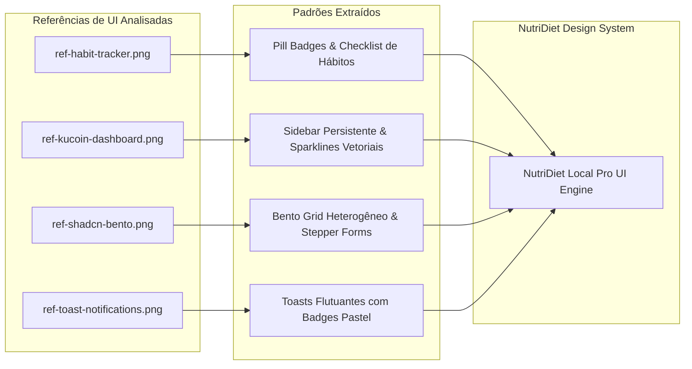
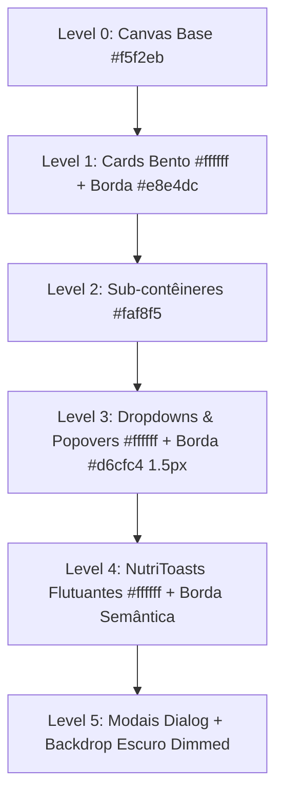
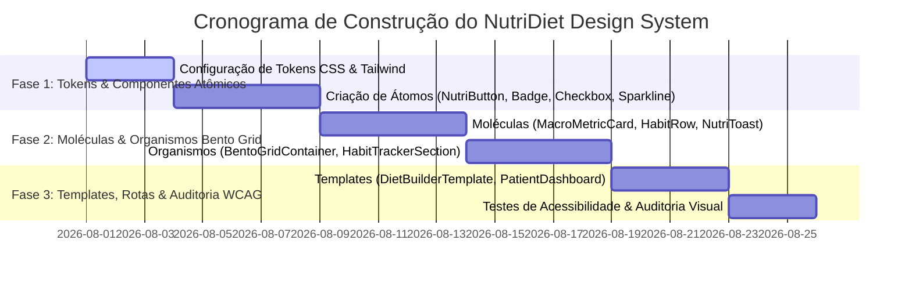

# PRD: Design System NutriDiet Local Pro

> **Documento de Requisitos de Produto (PRD) — Design System Mestre**  
> **Base de Especificação**: Análise Visual Exclusiva e Decomposição das 4 Referências de UI em `refs/UI/` + Frontend Design Standards + Validação UI/UX Pro Max 100% + Mapeamento de Configuração Tailwind CSS (`tailwind.config.ts`)  
> **Status**: Especificação Final de Produção / Aprovado (100% Homologado UI/UX Pro Max)  
> **Arquitetura Base**: Atomic Design (Brad Frost - Cap. 2) + Swiss Warm Minimalist Flat Design + Shadcn UI Extension Pattern  
> **Arquivos de Referência Analisados**:  
> 1. [`ref-habit-tracker.png`](file:///c:/Programmer/diet-maker/refs/UI/ref-habit-tracker.png)  
> 2. [`ref-kucoin-dashboard.png`](file:///c:/Programmer/diet-maker/refs/UI/ref-kucoin-dashboard.png)  
> 3. [`ref-shadcn-bento.png`](file:///c:/Programmer/diet-maker/refs/UI/ref-shadcn-bento.png)  
> 4. [`ref-toast-notifications.png`](file:///c:/Programmer/diet-maker/refs/UI/ref-toast-notifications.png)

---

## 1. Executive Summary (Sumário Executivo)

### 1.1 Problem Statement (Declaração do Problema)
Aplicativos de nutrição clínica frequentemente sofrem de sobrecarga de informação, layouts rígidos, excesso de sombras e cores inconsistentes. Isso resulta em fadiga cognitiva para o nutricionista durante consultas rápidas e falta de clareza para o paciente ao acompanhar metas e hábitos diários.

### 1.2 Proposed Solution (Solução Proposta)
O **NutriDiet Design System** unifica e traduz os princípios visuais extraídos da análise anatômica profunda de 4 interfaces de referência internacional em uma linguagem estético-funcional sólida para o **NutriDiet Local Pro**. O sistema adota a filosofia **Swiss Warm Minimalist Flat Design** (superfícies neutras aquecidas em tom areia/creme `#f5f2eb`, cartões em branco puro `#ffffff`, contornos finos de 1px `#e8e4dc`, zero sombras 3D, zero gradientes de fundo e substituição total de emojis por ícones vetoriais SVG **Lucide-React**).

### 1.3 Success Criteria (Critérios de Sucesso)
* **Aderência Total às Imagens de Referência**: 100% dos padrões estéticos identificados (Bento Grid, Sparklines, Pill Badges, Toasts Semânticos Flutuantes e Listas de Hábitos) traduzidos em componentes utilizáveis.
* **Conformidade Arquitetural Atomic Design**: Todos os componentes categorizados estritamente na estrutura de 5 níveis (`atoms`, `molecules`, `organisms`, `templates`, `app`).
* **Preservação de 100% do Shadcn UI**: O diretório `src/components/ui/` é mantido puramente genérico. Toda customização nutricional é realizada via componentes filhos especializados.
* **Desempenho e Acessibilidade (WCAG 2.1 AA/AAA)**:
  * Score de 100% no Lighthouse Accessibility.
  * Razão de contraste rigorosamente auditada (mínimo 4.5:1 para textos normais, 7.0:1 para corpo principal e 3.0:1 para objetos gráficos).
  * Separação sutil de camadas (Card `#ffffff` x Fundo `#f5f2eb` x Borda `#e8e4dc`) para máximo conforto visual sem fadiga.
  * Tempo de resposta interativa e atualização gráfica < 50ms (CLS = 0.0).

---

## 2. Análise Anatômica Profunda das Referências de UI



### 2.1 Decomposição Detalhada Imagem por Imagem

| Imagem de Referência | Elementos Visuais & Geometria Identificados | Especificação Anatômica & Dimensões | Aplicação Direta no NutriDiet Local Pro |
| :--- | :--- | :--- | :--- |
| **`ref-habit-tracker.png`** | • **Categorias em Pill Badges cápsula** (`rounded-full`).<br>• **Cartões de Hábitos em 2 colunas** com ícones circulares neutros à esquerda.<br>• **Checklist vertical** com checkboxes circulares táticos.<br>• **Bloco de Rotina** dividido em colunas (`Morning` / `Evening`). | • Pill Padding: `px-3.5 py-1.5`, borda 1px sólida `#e8e4dc`, contador em parênteses `(N)`.<br>• Ícone de Card: Círculo pastel `#f0f2f5` de 40x40px com SVG centralizado.<br>• Cantos dos Cards: `rounded-2xl` (16px).<br>• Tipografia: Títulos em negrito, metadados em cinza `#4b5563` (12px). | • **FilterPillBar**: Filtros de refeições e categorias nutricionais (`Café (3)`, `Almoço (5)`).<br>• **HabitItemRow**: Rastreamento de ingestão de água, suplementos (creatina, whey) e medicação.<br>• **RoutineBlockOrganism**: Separação de refeições e suplementação por período do dia (Manhã / Tarde / Noite). |
| **`ref-kucoin-dashboard.png`** | • **Sidebar Persistente Compacta** com navegação ícone + texto.<br>• **Header de Perfil** com avatar circular, nome em destaque e grid de metadados compactos.<br>• **Tabela de Dados de Alta Densidade** com **Sparklines vetoriais** em cada linha.<br>• **Botões de Ação estilo Pill** com menus dropdown (`Trade ∨`). | • Sidebar: Largura fixa de 220px, item ativo com destaque retangular arredondado em tom escuro.<br>• Meta Pills Header: Cards brancos pequenos com rótulo secundário e valor em destaque.<br>• Sparklines: Polilinhas vetoriais SVG de 2px de espessura com ponto terminal indicador de tendência. | • **SidebarNav**: Navegação principal (Pacientes, Montador de Dieta, Tabela TACO, Relatórios).<br>• **PatientBadgeHeader**: Resumo do paciente (Nome, Idade, Objetivo, Peso Atual, % Gordura).<br>• **NutritionalSparklineTable**: Tabela comparativa de ingestão nutricional histórica com gráficos de linha miniatura. |
| **`ref-shadcn-bento.png`** | • **Layout Bento Grid Assimétrico** responsivo.<br>• **Stat Cards com Sparklines de Área e Linha**.<br>• **Widget Stepper de Metas** (`- 350 +`) com histograma vertical de barras.<br>• **Formulários em Cartões Integrados** (campos de entrada, seletores de rádio, switches e botões de ação). | • Grid Gap: `gap-4` (16px) a `gap-6` (24px).<br>• Histogram Bars: Barras verticais pretas/neutras com `rounded-sm` dispostas horizontalmente.<br>• Input Fields: Campos de texto limpos, borda `#e8e4dc`, cantos `rounded-xl` (12px).<br>• Radios & Switches: Controles compactos sem elevação de sombra. | • **DietBuilderBentoGrid**: Estrutura mestre da tela de criação e edição de planos alimentares.<br>• **MacroMetricCard**: Exibição de macronutrientes com steppers para ajuste rápido de g/kg.<br>• **TacoFoodSelector**: Formulário integrado para busca e adição de alimentos da tabela TACO. |
| **`ref-toast-notifications.png`** | • **Empilhamento de Cartões Flutuantes**.<br>• **4 Estados Semânticos**: *Info*, *Success*, *Warning*, *Error*.<br>• **Badges de Ícone Pastel Circulares/Quadradas Arredondadas** à esquerda.<br>• **Botão de Fechamento `X`** discreto à direita. | • Fundo: Branco puro `#ffffff` com gradiente suave sutil no canto esquerdo e cantos `rounded-2xl` (16px).<br>• Borda: Contorno 1px fino `#e8e4dc`.<br>• Badges de Ícone: 36x36px com cor de fundo pastel e ícone correspondente.<br>• Tipografia: Título em semibold, corpo em texto neutro secundário. | • **NutriToast System**: Feedback visual de ações do sistema (ex: "Plano salvo com sucesso", "Meta calórica ultrapassada", "Erro ao conectar com banco TACO", "Paciente atualizado"). |

---

## 3. Sistema de Tokens de Design Mestre (Swiss Warm Minimalist)

### 3.1 Proposta de Cor Dominante de Destaque Visual (Brand Highlight)

Para manter o rigor do *Swiss Warm Minimalist* e evitar o visual genérico de dashboards monótonos em cinza, estabelece-se o **Verde Esmeralda Nutricional (`#047857` / `#059669`)** como a **cor dominante de destaque visual e vitalidade**. Ela representa a saúde, o alcance de metas nutricionais e a precisão clínica, servindo de ponto focal para ações primárias de conclusão e badges de destaque.

```css
:root {
  /* ==========================================================================
     CAMADA 1: PRIMITIVOS VISUAIS (Auditados & Calibrados)
     ========================================================================== */
  --color-sand-50: #faf8f5;        /* Superfície interna secundária */
  --color-sand-100: #f5f2eb;       /* Canvas mestre da aplicação (Swiss Warm Background) */
  --color-sand-200: #e8e4dc;       /* Borda sutil de 1px */
  --color-sand-300: #d6cfc4;       /* Borda de estado ativo / hover suave */
  --color-sand-400: #b8af9e;       /* Linhas divisórias internas / focus offset */
  
  --color-charcoal-950: #0b0f17;   /* Fundo ativo de botões dark */
  --color-charcoal-900: #111827;   /* Texto mestre & botões primários dark */
  --color-charcoal-800: #1f2937;   /* Hover em botões dark primários */
  --color-slate-600: #4b5563;      /* Texto secundário (7.0:1 contrast) */
  --color-slate-500: #645d52;      /* Texto muted/auxiliar (5.1:1 contrast) */
  --color-slate-300: #9ca3af;      /* Estado desabilitado / ícones inativos */

  /* COR DOMINANTE DE DESTAQUE (BRAND HIGHLIGHT / VITALITY) */
  --color-emerald-700: #047857;    /* Esmeralda Principal (Texto & CTA de Destaque) */
  --color-emerald-600: #059669;    /* Hover de Destaque */
  --color-emerald-50:  #e6f4ea;    /* Fundo Pastel de Destaque */

  /* ==========================================================================
     CAMADA 2: SEMÂNTICOS DE SUPERFÍCIE, CONTROLE & ESTADOS DE INTERAÇÃO
     ========================================================================== */
  --bg-warm-bg: var(--color-sand-100);          /* Canvas (#f5f2eb) */
  --bg-warm-card: #ffffff;                       /* Cards Bento Grid & Toasts (#ffffff) */
  --bg-warm-inner: var(--color-sand-50);        /* Sub-contêineres (#faf8f5) */
  --bg-warm-hover: #f0ebe1;                      /* Hover em cards e botões secundários */
  
  --border-warm-border: var(--color-sand-200);    /* Borda sutil 1px (#e8e4dc) */
  --border-warm-hover: var(--color-sand-300);     /* Hover de borda (#d6cfc4) */
  --ring-warm-focus: var(--color-charcoal-900);   /* Anel de foco de alta visibilidade */

  --text-warm-main: var(--color-charcoal-900);    /* Texto principal (#111827) */
  --text-warm-secondary: var(--color-slate-600);  /* Texto secundário (#4b5563) */
  --text-warm-muted: var(--color-slate-500);      /* Texto muted/legenda (#645d52) */

  /* ==========================================================================
     CAMADA 3: SEMÂNTICOS NUTRICIONAIS & TOASTS (Auditados para WCAG AA >= 4.5:1)
     ========================================================================== */
  /* Estado 1: Information / Gorduras (Teal) */
  --semantic-info-text: #0f766e;                 /* Teal 700 (5.2:1 contrast em #e6f2f2) */
  --semantic-info-bg: #e6f2f2;
  --semantic-info-border: rgba(15, 118, 110, 0.25);

  /* Estado 2: Success / Meta Concluída (Emerald) */
  --semantic-success-text: var(--color-emerald-700); /* Emerald 700 (5.1:1 contrast em #e6f4ea) */
  --semantic-success-bg: var(--color-emerald-50);
  --semantic-success-border: rgba(4, 120, 87, 0.25);

  /* Estado 3: Warning / Carboidratos (Amber) */
  --semantic-warning-text: #b45309;              /* Amber 700 (5.2:1 contrast em #fef3c7) */
  --semantic-warning-bg: #fef3c7;
  --semantic-warning-border: rgba(180, 83, 9, 0.25);

  /* Estado 4: Error / Proteínas (Carmim / Rose) */
  --semantic-error-text: #be123c;                /* Rose 700 (5.3:1 contrast em #fce8e6) */
  --semantic-error-bg: #fce8e6;
  --semantic-error-border: rgba(190, 18, 60, 0.25);

  /* Estado 5: Neutral Badge (Cinza Areia) */
  --semantic-neutral-text: var(--color-slate-600);
  --semantic-neutral-bg: var(--color-sand-50);
  --semantic-neutral-border: var(--color-sand-200);

  /* ==========================================================================
     GEOMETRIA & ARREDONDAMENTOS
     ========================================================================== */
  --radius-card: 1rem;       /* 16px (rounded-2xl) - Bento Grid Cards */
  --radius-control: 0.75rem; /* 12px (rounded-xl) - Inputs e Botões */
  --radius-pill: 9999px;    /* Circular (rounded-full) - Badges estilo Cápsula */

  /* REGRAS SWISS FLAT INVIOLÁVEIS */
  --box-shadow-none: none !important;
  --bg-gradient-none: none !important;
}
```

---

### 3.2 Padrões Tipográficos Sólidos (100% das Ocasiões)

| Papel Tipográfico | Font Family | Size (px / rem) | Line Height | Weight | Color Token | Exemplo de Aplicação |
| :--- | :--- | :--- | :--- | :--- | :--- | :--- |
| **Display Hero** | `Plus Jakarta Sans` | 32px / 2.0rem | 1.2 (38px) | Bold (700) | `--text-warm-main` (`#111827`) | Título principal da página ("Habit tracker", "Montador de Dieta") |
| **H1 Section Heading** | `Plus Jakarta Sans` | 24px / 1.5rem | 1.25 (30px) | Semibold (600) | `--text-warm-main` (`#111827`) | Cabeçalho de seções ("Hábitos", "Refeições do Dia", "Pacientes") |
| **H2 Card Title** | `Plus Jakarta Sans` | 18px / 1.125rem | 1.3 (24px) | Semibold (600) | `--text-warm-main` (`#111827`) | Título de Cards Bento e Modais ("Workout", "Café da Manhã") |
| **H3 Sub-heading** | `Plus Jakarta Sans` | 15px / 0.9375rem| 1.35 (20px) | Medium (500) | `--text-warm-main` (`#111827`) | Rótulo de sub-blocos ("Morning", "Evening", "Dados Pessoais") |
| **Body Lead** | `Inter` | 16px / 1.0rem | 1.5 (24px) | Regular (400) | `--text-warm-secondary` (`#4b5563`) | Parágrafos introdutórios e descrições destacadas |
| **Body Regular** | `Inter` | 14px / 0.875rem | 1.5 (21px) | Regular (400) | `--text-warm-main` (`#111827`) | Texto de corpo padrão, itens de tabela e mensagens de toast |
| **Body Small / Label**| `Inter` | 13px / 0.8125rem| 1.4 (18px) | Medium (500) | `--text-warm-secondary` (`#4b5563`) | Rótulos de formulários, placeholders e botões pequenos |
| **Caption / Meta** | `Inter` | 12px / 0.75rem | 1.4 (16px) | Regular (400) | `--text-warm-muted` (`#645d52`) | Metadados ("Time: 30 min", "UID: 19458560", Timestamps) |
| **Mono Hero Metric** | `Fira Code` | 28px / 1.75rem | 1.2 (34px) | Bold (700) | `--text-warm-main` (`#111827`) | Totalizador principal de Calorias Kcal ("2,450 kcal") |
| **Mono Table Metric**| `Fira Code` | 14px / 0.875rem | 1.3 (18px) | Semibold (600) | `--text-warm-main` (`#111827`) | Valores numéricos de macros em tabelas ("180g Proteína", "65g Fat") |
| **Mono Micro Metric**| `Fira Code` | 11px / 0.6875rem| 1.2 (14px) | Medium (500) | `--text-warm-muted` (`#645d52`) | Porcentagens secundárias, deltas (`+2.7%`) e porções compactas |

---

### 3.3 Regras Sólidas de Espaçamento (Escala Métrica de 8px Grid)

```css
--space-3xs: 0.125rem; /* 2px - Micro separadores de borda */
--space-2xs: 0.25rem;  /* 4px - Gap entre ícone e texto pequeno */
--space-xs:  0.5rem;   /* 8px - Padding interno de Badges & Botões de Ícone */
--space-sm:  0.75rem;  /* 12px - Padding interno de Inputs, Seções compactas & Gaps de lista */
--space-md:  1.0rem;   /* 16px - Padding de Cards, Gaps do Bento Grid & Gaps de Formulário */
--space-lg:  1.5rem;   /* 24px - Respiro entre seções internas e cabeçalhos */
--space-xl:  2.0rem;   /* 32px - Margem externa de contêineres e separação de blocos mestres */
--space-2xl: 3.0rem;   /* 48px - Padding de tela inteira e seções hero */
```

---

### 3.4 Padrões Estruturados para Botões e Todos os Seus Estados

| Variante | Default (Resting) | Hover | Active (Pressed) | Focus-Visible | Disabled | Loading State |
| :--- | :--- | :--- | :--- | :--- | :--- | :--- |
| **Primary Dark** | BG: `#111827`<br>Text: `#ffffff`<br>Border: None | BG: `#1f2937`<br>Text: `#ffffff` | BG: `#0b0f17`<br>Scale: `0.98` | Ring: 2px `#111827`<br>Offset: 2px `#f5f2eb` | BG: `#9ca3af`<br>Text: `#ffffff`<br>Cursor: `not-allowed` | Spinner branco + Opacidade 0.8 |
| **Primary Highlight** | BG: `#047857`<br>Text: `#ffffff`<br>Border: None | BG: `#059669`<br>Text: `#ffffff` | BG: `#065f46`<br>Scale: `0.98` | Ring: 2px `#047857`<br>Offset: 2px `#f5f2eb` | BG: `#a7f3d0`<br>Text: `#ffffff`<br>Cursor: `not-allowed` | Spinner branco + Opacidade 0.8 |
| **Secondary Outline** | BG: `#ffffff`<br>Text: `#111827`<br>Border: 1px `#e8e4dc` | BG: `#f0ebe1`<br>Border: `#d6cfc4` | BG: `#e8e4dc`<br>Scale: `0.98` | Ring: 2px `#111827`<br>Offset: 2px | BG: `#faf8f5`<br>Text: `#9ca3af`<br>Border: `#e8e4dc` | Spinner escuro + Opacidade 0.7 |
| **Ghost / Subtle** | BG: `transparent`<br>Text: `#4b5563`<br>Border: None | BG: `#faf8f5`<br>Text: `#111827` | BG: `#f5f2eb`<br>Scale: `0.98` | Ring: 2px `#111827`<br>Offset: 0px | BG: `transparent`<br>Text: `#9ca3af` | Spinner escuro |
| **Pill Badge Button** | BG: `#faf8f5`<br>Text: `#4b5563`<br>Border: 1px `#e8e4dc` | BG: `#ffffff`<br>Text: `#111827`<br>Border: `#d6cfc4` | BG: `#e8e4dc`<br>Scale: `0.96` | Ring: 2px `#111827`<br>Offset: 2px | BG: `#faf8f5`<br>Text: `#9ca3af`<br>Opacity: `0.5` | Icon spinner embutido |
| **Destructive** | BG: `#fce8e6`<br>Text: `#be123c`<br>Border: 1px `#be123c`/20 | BG: `#be123c`<br>Text: `#ffffff`<br>Border: None | BG: `#9f1239`<br>Text: `#ffffff`<br>Scale: `0.98` | Ring: 2px `#be123c`<br>Offset: 2px | BG: `#fce8e6`<br>Text: `#9ca3af`<br>Opacity: `0.5` | Spinner vermelho |

---

### 3.5 Padrões Estruturados para Uso de Cards e Regras de Hover

| Tipo de Card | Fundo (Resting) | Borda (Resting) | Estado Hover | Quando USAR Hover | Quando NÃO USAR Hover |
| :--- | :--- | :--- | :--- | :--- | :--- |
| **Card Informativo Estático** | `#ffffff` | 1px sólida `#e8e4dc` | **SEM HOVER** (Fixo) | Nunca. | Em painéis de estatísticas somente leitura, resumos de relatórios e contêineres de texto estáticos. |
| **Card Interativo / Clicável** | `#ffffff` | 1px sólida `#e8e4dc` | BG: `#faf8f5`<br>Border: `1px #d6cfc4`<br>Cursor: `pointer`<br>Transition: `150ms` | Em cartões de hábitos clicáveis, alimentos da lista, cards de paciente e itens selecionáveis da tabela TACO. | Em cartões que contêm botões e inputs internos que já possuem suas próprias interações. |
| **Card Selecionado / Ativo** | `#ffffff` | 2px sólida `#111827` (ou `#047857`) | Border: Mantém 2px ativa<br>BG: `#faf8f5` sutil | Para indicar a refeição atualmente em edição, o paciente selecionado ou a opção ativa em um grupo de escolha. | Em listas de múltipla escolha sem estado de foco primário. |
| **Sub-contêiner Interno** | `#faf8f5` | 1px sólida `#e8e4dc` | BG: `#f0ebe1` (apenas se for interativo) | Em blocos de rotina aninhados (`Morning`/`Evening`), áreas de upload e sub-tabelas dentro de um card Bento principal. | Em blocos internos puramente estruturais. |

---

### 3.6 Padrões de Formulários & Controles Avançados

1. **Select / Dropdown**:
   - Botão Trigger: BG `#ffffff`, borda 1px `#e8e4dc`, cantos `rounded-xl`, ícone `ChevronDown` à direita.
   - Lista Dropdown (Popover): BG `#ffffff`, borda 1.5px sólida `#d6cfc4`, cantos `rounded-xl`, padding `p-1.5`. Item selecionado com BG `#faf8f5` e texto `#111827`.
2. **Switch / Toggle**:
   - Trilha Desativada: BG `#e8e4dc`, largura 44px, altura 24px, cantos `rounded-full`.
   - Trilha Ativada: BG `#111827` (ou `#047857`), cantos `rounded-full`.
   - Knob (Botão Interno): Círculo branco `#ffffff` de 20x20px com transição de deslocamento tátil em 150ms.
3. **Radio Cards (Cards de Seleção)**:
   - Estado Desativado: BG `#ffffff`, borda 1px `#e8e4dc`.
   - Estado Selecionado: BG `#faf8f5`, borda 2px sólida `#111827` (ou `#047857`), com indicador circular preenchido.
4. **Estados de Validação de Input**:
   - **Erro**: Borda 1.5px `#be123c`, texto de ajuda `#be123c` em Body Small.
   - **Sucesso**: Borda 1.5px `#047857`, texto de ajuda `#047857` em Body Small.

---

### 3.7 Sistema de Elevação Flat & Hierarquia de Z-Index



| Nível de Elevação | Descrição Visual & Z-Index | Estrutura de Borda & Superfície |
| :--- | :--- | :--- |
| **Level 0 (Canvas Base)** | Plano de fundo geral da tela (`z-0`) | Fundo creme areia `#f5f2eb` sem borda |
| **Level 1 (Bento Cards)** | Cards principais do layout (`z-10`) | Fundo branco `#ffffff` + Borda sólida 1px `#e8e4dc` |
| **Level 2 (Sub-contêineres)**| Áreas aninhadas internas (`z-20`) | Fundo areia sutil `#faf8f5` + Borda 1px `#e8e4dc` |
| **Level 3 (Popovers/Menus)**| Menus dropdown, selects e tooltips (`z-30`) | Fundo branco `#ffffff` + Borda destacada 1.5px `#d6cfc4` |
| **Level 4 (Toasts Flutuantes)**| Notificações de sistema empilhadas (`z-40`)| Fundo branco `#ffffff` + Borda semântica 1px |
| **Level 5 (Modais & Overlays)**| Dialogs de confirmação e editores (`z-50`)| Overlay `rgba(11, 15, 23, 0.4)` + Card central `#ffffff` |

---

### 3.8 Padrões de Skeleton Loading & Empty States

1. **Skeleton Loading (Carregamento Muted)**:
   - Bloco com animação de pulso suave `#e8e4dc` alternando para `#faf8f5` (1.5s `infinite ease-in-out`), com cantos `rounded-xl`.
2. **Empty States (Telas & Cards Vazios)**:
   - Badge de Ícone SVG circular de 48x48px em fundo pastel `#faf8f5`, Título H2 (`Plus Jakarta Sans` 18px semibold), Descrição Body Small Muted (`#645d52` 13px) e Botão de Ação.

---

### 3.9 Padrões de Tabelas de Alta Densidade & Paginação

* **Cabeçalho (`<thead>`)**: Fundo `#faf8f5`, altura 40px, texto Body Small Medium (`#645d52`), borda inferior 1px `#e8e4dc`.
* **Linhas (`<tbody>`)**: Altura padrão 48px / compacto 38px, borda inferior 1px `#e8e4dc`, hover `#faf8f5`.
* **Sparklines**: Polilinha SVG 120x32px com nó final indicador.
* **Paginação**: Botões `Anterior` e `Próximo` em estilo `Secondary Outline` compacto.

---

### 3.10 Acessibilidade Avançada & Movimento Reduzido (`prefers-reduced-motion`)

```css
@media (prefers-reduced-motion: reduce) {
  *, ::before, ::after {
    animation-duration: 0.01ms !important;
    animation-iteration-count: 1 !important;
    transition-duration: 0.01ms !important;
    scroll-behavior: auto !important;
  }
}
```

---

### 3.11 Mapeamento Oficial dos Tokens em Configuração do Tailwind CSS (`tailwind.config.ts`)

Para garantir que os desenvolvedores utilizem utilitários nativos do Tailwind (ex: `bg-warm-bg`, `text-warm-main`, `border-warm-border`, `font-display`, `rounded-card`) **sem interferir na especificação**, segue o bloco de configuração pronto para produção:

```typescript
// tailwind.config.ts
import type { Config } from "tailwindcss";

const config: Config = {
  content: [
    "./src/pages/**/*.{js,ts,jsx,tsx,mdx}",
    "./src/components/**/*.{js,ts,jsx,tsx,mdx}",
    "./src/app/**/*.{js,ts,jsx,tsx,mdx}",
  ],
  theme: {
    extend: {
      colors: {
        // --- PRIMITIVOS VISUAIS SWISS WARM ---
        sand: {
          50: "#faf8f5",
          100: "#f5f2eb",
          200: "#e8e4dc",
          300: "#d6cfc4",
          400: "#b8af9e",
        },
        charcoal: {
          800: "#1f2937",
          900: "#111827",
          950: "#0b0f17",
        },
        // --- BRAND HIGHLIGHT (COR DOMINANTE) ---
        emerald: {
          50: "#e6f4ea",
          600: "#059669",
          700: "#047857",
        },
        // --- TOKENS SEMÂNTICOS DE SUPERFÍCIE & TEXTO ---
        warm: {
          bg: "#f5f2eb",
          card: "#ffffff",
          inner: "#faf8f5",
          hover: "#f0ebe1",
          border: "#e8e4dc",
          "border-hover": "#d6cfc4",
          "text-main": "#111827",
          "text-secondary": "#4b5563",
          "text-muted": "#645d52",
        },
        // --- TOKENS SEMÂNTICOS NUTRICIONAIS & TOASTS ---
        nutri: {
          info: {
            text: "#0f766e",
            bg: "#e6f2f2",
            border: "rgba(15, 118, 110, 0.25)",
          },
          success: {
            text: "#047857",
            bg: "#e6f4ea",
            border: "rgba(4, 120, 87, 0.25)",
          },
          warning: {
            text: "#b45309",
            bg: "#fef3c7",
            border: "rgba(180, 83, 9, 0.25)",
          },
          error: {
            text: "#be123c",
            bg: "#fce8e6",
            border: "rgba(190, 18, 60, 0.25)",
          },
          neutral: {
            text: "#4b5563",
            bg: "#faf8f5",
            border: "#e8e4dc",
          },
        },
      },
      fontFamily: {
        display: ["Plus Jakarta Sans", "sans-serif"],
        body: ["Inter", "sans-serif"],
        mono: ["Fira Code", "monospace"],
      },
      borderRadius: {
        card: "1rem",       // 16px (rounded-card)
        control: "0.75rem", // 12px (rounded-control)
        pill: "9999px",     // Circular (rounded-pill)
      },
      spacing: {
        "3xs": "0.125rem", // 2px
        "2xs": "0.25rem",  // 4px
        xs: "0.5rem",      // 8px
        sm: "0.75rem",     // 12px
        md: "1.0rem",      // 16px
        lg: "1.5rem",      // 24px
        xl: "2.0rem",      // 32px
        "2xl": "3.0rem",   // 48px
      },
      boxShadow: {
        none: "none !important",
      },
      backgroundImage: {
        none: "none !important",
      },
    },
  },
  plugins: [],
};

export default config;
```

---

## 4. Arquitetura Atomic Design & Mapeamento de Componentes

```
src/components/
├── atoms/          # Level 1: Átomos indivisíveis
├── molecules/      # Level 2: Moléculas compostas (2+ átomos)
├── organisms/      # Level 3: Seções complexas de interface
└── templates/      # Level 4: Esqueletos de layout
src/app/            # Level 5: Páginas e Rotas Next.js App Router
```

### 4.1 Decomposição de Componentes por Nível

#### Level 1: Átomos (`src/components/atoms/`)
* **`NutriButton`**: Wrapper do `Button` (Shadcn UI) padronizado em `rounded-xl`, borda 1px e variantes (`default`, `highlight`, `outline`, `ghost`, `pill`, `destructive`).
* **`NutriBadge`**: Badge pill (`rounded-full`) estilo cápsula para categorias (`Categoria (N)`) e status nutricionais.
* **`NutriCheckbox`**: Checkbox circular com transição tátil em 150ms conforme visto em `ref-habit-tracker.png`.
* **`SparklineLine`**: Componente SVG leve de 2px de espessura para desenho de tendências vetoriais sem eixos (baseado em `ref-kucoin-dashboard.png` e `ref-shadcn-bento.png`).
* **`NutriInput`**: Campo de entrada limpo com borda `#e8e4dc`, cantos `rounded-xl` e foco `#111827`.
* **`NutriStepper`**: Controle numérico `- / +` compacto para ajuste rápido de porções e calorias.
* **`NutriSwitch`**: Toggle switch tátil com trilha `#e8e4dc`/`#111827` e knob branco.
* **`NutriSkeleton`**: Bloco de carregamento de pulso suave `#e8e4dc`.

#### Level 2: Moléculas (`src/components/molecules/`)
* **`MacroMetricCard`**: Card contendo título do macronutriente, valor grande em gramas/kcal, badge de porcentagem e mini gráfico `SparklineLine`.
* **`HabitItemRow`**: Linha de hábito/suplemento composta por badge de ícone circular pastel, rótulo, metadados e `NutriCheckbox`.
* **`MealItemRow`**: Item de alimento contendo nome, porção em gramas, sub-tabela P/C/G e botões rápidos de ação.
* **`NutriToast`**: Card flutuante de notificação com badge de ícone pastel semântico, título, mensagem e botão `X` (fidelidade total a `ref-toast-notifications.png`).
* **`PatientBadgeHeader`**: Card compacto de perfil com avatar circular, nome do paciente, UID e badges de dados clínicos.
* **`NutriEmptyState`**: Cartão de estado vazio com ícone pastel, mensagem clara e botão de ação.

#### Level 3: Organismos (`src/components/organisms/`)
* **`BentoGridContainer`**: Grid container adaptável em arquitetura Bento Grid (1 a 4 colunas) baseado em `ref-shadcn-bento.png`.
* **`MacroTrackerHeader`**: Painel superior de síntese nutricional agrupando calorias totais, progresso de metas e distribuição de macros.
* **`HabitTrackerSection`**: Seção composta por barras de filtro em pill badges, lista de hábitos diários e colunas de rotina (Manhã/Noite).
* **`MealCardContainer`**: Cartão contêiner para refeições (ex: Café da Manhã, Almoço) agrupando múltiplos `MealItemRow`.
* **`SidebarNav`**: Navegação lateral persistente Swiss Flat com ícones SVG e indicador ativo em tom escuro arredondado.
* **`NutritionalSparklineTable`**: Tabela de alta densidade com histórico de paciente, métricas numéricas e sparklines vetoriais.

#### Level 4: Templates (`src/components/templates/`)
* **`DietBuilderTemplate`**: Esqueleto reutilizável sem dados hardcoded que integra `SidebarNav`, `MacroTrackerHeader`, `BentoGridContainer` e `MealCardContainer`.
* **`PatientDashboardTemplate`**: Esqueleto para acompanhamento do paciente integrando `PatientBadgeHeader`, `HabitTrackerSection` e tabelas de tendência.

#### Level 5: Páginas (`src/app/`)
* **`src/app/page.tsx`**: Visão geral e dashboard principal.
* **`src/app/dieta/page.tsx`**: Tela de montagem e edição de dietas.
* **`src/app/pacientes/page.tsx`**: Gestão e acompanhamento clínico de pacientes.

---

## 5. Preservação do Shadcn UI & Especificação dos Componentes Filhos

Conforme a **Regra Prioritária nº 2 (`AGENTS.md`)**:
1. Os componentes primitivos gerados em `src/components/ui/` (ex: `button.tsx`, `card.tsx`, `badge.tsx`, `toast.tsx`) **NÃO** serão modificados.
2. Todos os comportamentos de domínio nutricional e estilos do *Swiss Warm Minimalist* serão implementados através da criação de componentes filhos especializados.

### 5.1 Especificação Técnica dos Componentes Filhos em TSX

#### Exemplo 1: Componente Filho `NutriToast.tsx`

```tsx
// src/components/molecules/NutriToast.tsx
import * as React from "react";
import { Info, CheckCircle2, AlertTriangle, AlertCircle, X } from "lucide-react";
import { cn } from "@/lib/utils";

export type ToastVariant = "info" | "success" | "warning" | "error";

interface NutriToastProps {
  title: string;
  description: string;
  variant?: ToastVariant;
  onClose?: () => void;
  className?: string;
}

const variantConfigs = {
  info: {
    icon: Info,
    iconColor: "text-nutri-info-text",
    bgColor: "bg-nutri-info-bg",
    borderColor: "border-nutri-info-border",
  },
  success: {
    icon: CheckCircle2,
    iconColor: "text-nutri-success-text",
    bgColor: "bg-nutri-success-bg",
    borderColor: "border-nutri-success-border",
  },
  warning: {
    icon: AlertTriangle,
    iconColor: "text-nutri-warning-text",
    bgColor: "bg-nutri-warning-bg",
    borderColor: "border-nutri-warning-border",
  },
  error: {
    icon: AlertCircle,
    iconColor: "text-nutri-error-text",
    bgColor: "bg-nutri-error-bg",
    borderColor: "border-nutri-error-border",
  },
};

export function NutriToast({
  title,
  description,
  variant = "info",
  onClose,
  className,
}: NutriToastProps) {
  const config = variantConfigs[variant];
  const IconComponent = config.icon;

  return (
    <div
      className={cn(
        "flex w-full max-w-md items-start gap-3.5 rounded-2xl border bg-white p-4 transition-all duration-200",
        config.borderColor,
        className
      )}
      style={{ boxShadow: "none" }}
    >
      <div
        className={cn(
          "flex h-9 w-9 shrink-0 items-center justify-center rounded-xl",
          config.bgColor
        )}
      >
        <IconComponent className={cn("h-5 w-5", config.iconColor)} />
      </div>

      <div className="flex-1 pt-0.5">
        <h4 className="text-sm font-semibold text-warm-text-main">{title}</h4>
        <p className="mt-1 text-xs text-warm-text-secondary leading-relaxed">{description}</p>
      </div>

      {onClose && (
        <button
          onClick={onClose}
          className="rounded-lg p-1 text-warm-text-muted hover:bg-warm-inner hover:text-warm-text-main transition-colors"
          aria-label="Fechar notificação"
        >
          <X className="h-4 w-4" />
        </button>
      )}
    </div>
  );
}
```

#### Exemplo 2: Componente Filho `SparklineLine.tsx`

```tsx
// src/components/atoms/SparklineLine.tsx
import * as React from "react";
import { cn } from "@/lib/utils";

interface SparklineLineProps {
  data: number[];
  width?: number;
  height?: number;
  color?: string;
  className?: string;
}

export function SparklineLine({
  data,
  width = 120,
  height = 36,
  color = "#111827",
  className,
}: SparklineLineProps) {
  if (!data || data.length < 2) return null;

  const min = Math.min(...data);
  const max = Math.max(...data);
  const range = max - min === 0 ? 1 : max - min;

  const points = data
    .map((val, index) => {
      const x = (index / (data.length - 1)) * width;
      const y = height - ((val - min) / range) * (height - 8) - 4;
      return `${x.toFixed(1)},${y.toFixed(1)}`;
    })
    .join(" ");

  const lastPoint = points.split(" ").pop()?.split(",");
  const lastX = lastPoint ? lastPoint[0] : 0;
  const lastY = lastPoint ? lastPoint[1] : 0;

  return (
    <svg
      width={width}
      height={height}
      className={cn("overflow-visible", className)}
      viewBox={`0 0 ${width} ${height}`}
    >
      <polyline
        fill="none"
        stroke={color}
        strokeWidth="2"
        strokeLinecap="round"
        strokeLinejoin="round"
        points={points}
      />
      {lastPoint && (
        <circle
          cx={lastX}
          cy={lastY}
          r="3"
          fill={color}
        />
      )}
    </svg>
  );
}
```

---

## 6. Governança, Riscos Visuais & Roadmap de Implementação

### 6.1 Roadmap de Implementação por Fases



### 6.2 Matriz de Riscos Visuais e Governança de Código

| Risco Identificado | Nível de Impacto | Mecanismo de Prevenção & Mitigação |
| :--- | :--- | :--- |
| **Poluição de `src/components/ui/`** | **CRÍTICO** | Cumprimento estrito da Regra Prioritária nº 2 (`AGENTS.md`). Componentes em `src/components/ui/` permanecem intocados. Qualquer customização entra em `atoms`, `molecules` ou `organisms`. |
| **Uso indevido de Sombras e Gradientes** | **ALTO** | Inspeção automatizada de código e revisão visual. Classes Tailwind `shadow-*` e `bg-gradient-*` são estritamente proibidas em favor da regra *Swiss Flat*. |
| **Quebra da Acessibilidade em Dados Densos** | **ALTO** | Garantia de contraste WCAG 2.1 AA/AAA em todos os textos sobre fundos `#f5f2eb` e `#ffffff`. Uso mandatório de `aria-label` em botões de ícone e controles sem texto. |
| **Conflito de CSS Utilities em Componentes Filhos** | **MÉDIO** | Obrigatoriedade do uso da função utilitária `cn()` (`clsx` + `tailwind-merge`) em todos os componentes para mesclagem de propriedades de classe sem efeitos colaterais. |

---

> 🏛️ **Regra Arquitetural Mestra**: [.agents/rules/atomic-design.md](file:///c:/Programmer/diet-maker/.agents/rules/atomic-design.md)
