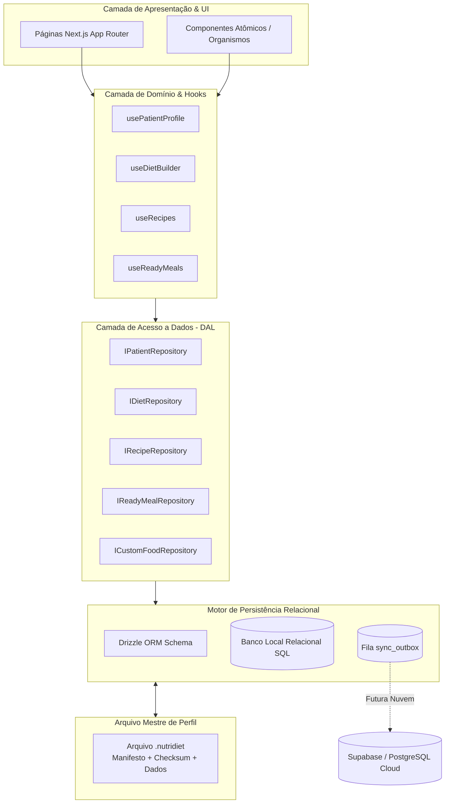

# 01. Visão Geral e Arquitetura do Banco Local

**Status:** Aprovado  
**Documento Anterior:** [Índice Canônico](./index.md)  
**Próximo Documento:** [02. Modelo de Dados e Schemas Relacionais](./02-modelo-de-dados-e-schemas.md)

---

## 1. Problema e Oportunidade

Nutricionistas acumulam centenas de pacientes, milhares de consultas, receitas com múltiplos ingredientes, blocos de refeições prontas, alimentos customizados e dietas com ciclo de carboidratos ao longo dos anos. 

### Limitações do Modelo Anterior (Chaves Soltas em LocalStorage):
- **Fragmentação**: Dados espalhados em chaves separadas (`nutridiet_patients`, `nutridiet_custom_foods`, `nutridiet_recipes`, `nutridiet_diets_*`, `nutridiet_assessments_*`).
- **Risco de Corrupção e Registros Órfãos**: Sem integridade referencial ou foreign keys, exclusões parciais criam dados corrompidos.
- **Sobrecarga de CPU**: Operações de busca e agregação executam varreduras de arrays em memória (`O(N)`).
- **Barreira para o Backend Online**: O modelo documental não reflete a estrutura relacional do banco de dados em nuvem (PostgreSQL/Supabase).

---

## 2. A Solução: Dieta DB Relacional Local

O **Dieta DB** implementa uma arquitetura de banco de dados relacional que roda 100% no cliente (navegador desktop), empacota todo o consultório em um **Arquivo Mestre de Perfil (`.nutridiet`)** e conecta-se à UI através de uma camada formal de repositórios tipados (DAL).

---

## 3. Princípios Fundamentais de Arquitetura

1. **Soberania e 100% Offline-First**: O aplicativo funciona sem requisições de rede. Todos os cálculos, buscas e persistências operam localmente.
2. **Separação Rítmica (Draft vs. Commit)**:
   - Digitação em tempo real opera em buffer contínuo (zero perda de dados por queda de energia ou fechamento de aba).
   - O banco relacional oficial é atualizado mediante *commit* explícito (ao clicar em "Salvar" ou `Ctrl+S`).
3. **Imutabilidade Clínica**: Prescrições passadas são registradas como *snapshots* imutáveis, preservando a verdade histórica do prontuário do paciente.
4. **Isolamento via Contratos (DAL)**: A UI consome apenas interfaces TypeScript dos repositórios. Nenhuma query SQL ou detalhe de baixo nível vaza para os componentes visuais.
5. **Caminho Limpo para Nuvem (Zero Retrabalho)**: Schemas modelados em Drizzle ORM compatíveis diretamente com PostgreSQL/Supabase.

---

## 4. Métricas de Performance e SLA Local

| Operação | Volume Testado | SLA Máximo | Alvo Típico |
| :--- | :--- | :--- | :--- |
| **Busca de Alimento (TACO + Custom)** | 1.000 itens | < 50ms | ~5ms |
| **Cálculo de Macros e Deltas** | Dieta inteira com 10 refeições | < 16ms (60 FPS) | ~2ms |
| **Commit Transacional no Banco** | Dieta completa com variações | < 100ms | ~15ms |
| **Leitura de Histórico de Paciente** | 50 consultas + 50 avaliações | < 50ms | ~8ms |
| **Exportação / Importação de `.nutridiet`** | Perfil com 500 pacientes | < 500ms | ~120ms |

---

## Próximos Passos
Consulte o detalhamento das tabelas e tipos relacionais em [02. Modelo de Dados e Schemas Relacionais](./02-modelo-de-dados-e-schemas.md).
