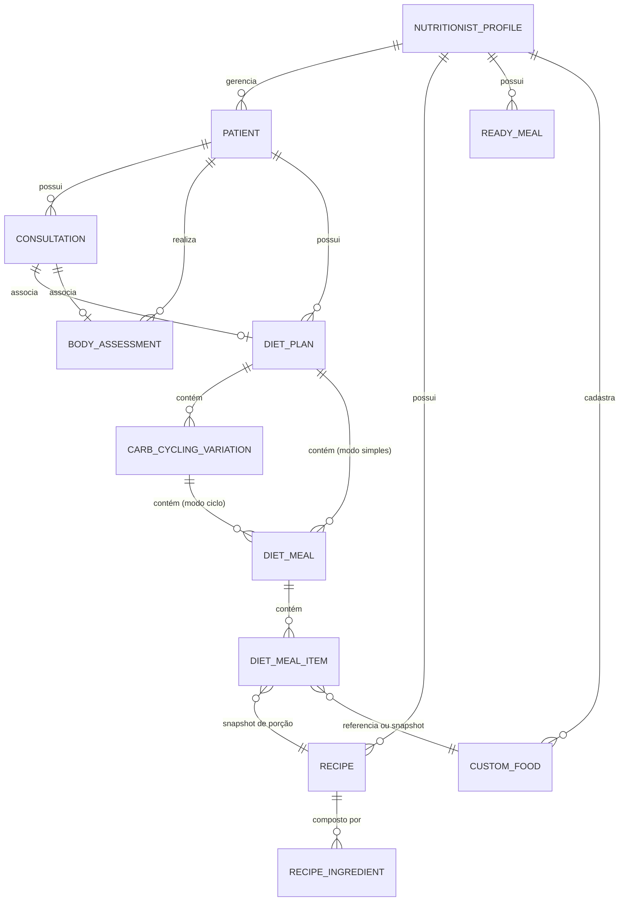

# 02. Modelo de Dados e Schemas Relacionais

**Status:** Aprovado  
**Documento Anterior:** [01. Visão Geral e Arquitetura do Banco Local](./01-visao-e-arquitetura-geral.md)  
**Próximo Documento:** [03. Receitas, Refeições Prontas e Imutabilidade Clínica](./03-receitas-refeicoes-e-imutabilidade-clinica.md)

---

## 1. Diagrama de Entidade-Relacionamento (ERD)

---

## 2. Dicionário de Tabelas e Campos

### 2.1 `nutritionist_profiles` (Perfil do Profissional)
Armazena a identidade do nutricionista e configurações clínicas do consultório.

| Campo | Tipo SQL | Restrição | Descrição |
| :--- | :--- | :--- | :--- |
| `id` | `VARCHAR(36)` | PK | UUID v7 do perfil |
| `name` | `VARCHAR(150)` | NOT NULL | Nome completo do profissional |
| `crn` | `VARCHAR(30)` | NOT NULL | Registro profissional (ex: "CRN-3 12345") |
| `email` | `VARCHAR(150)` | NULL | E-mail de contato |
| `clinic_name` | `VARCHAR(150)` | NULL | Nome fantasia da clínica/consultório |
| `logo_url` | `TEXT` | NULL | Logotipo em base64 ou URL local |
| `created_at` | `TIMESTAMP` | NOT NULL | Data de criação do perfil |
| `updated_at` | `TIMESTAMP` | NOT NULL | Data da última atualização cadastral |

---

### 2.2 `patients` (Cadastro de Pacientes)

| Campo | Tipo SQL | Restrição | Descrição |
| :--- | :--- | :--- | :--- |
| `id` | `VARCHAR(36)` | PK | UUID v7 ou Nanoid único |
| `code` | `VARCHAR(20)` | UNIQUE, NOT NULL | Código visual amigável (ex: "P-0001") |
| `name` | `VARCHAR(150)` | NOT NULL | Nome completo do paciente |
| `age` | `INTEGER` | NOT NULL | Idade em anos |
| `gender` | `VARCHAR(20)` | NOT NULL | Gênero ("Masculino", "Feminino", etc.) |
| `height_cm` | `REAL` | NOT NULL | Altura em centímetros |
| `weight_kg` | `REAL` | NOT NULL | Peso atual em kg |
| `target_kcal` | `INTEGER` | NOT NULL | Meta diária de VET |
| `target_protein` | `REAL` | NOT NULL | Meta de Proteínas em gramas |
| `target_carbs` | `REAL` | NOT NULL | Meta de Carboidratos em gramas |
| `target_fats` | `REAL` | NOT NULL | Meta de Gorduras em gramas |
| `objective` | `VARCHAR(50)` | NOT NULL | Objetivo clínico ("Cutting", "Bulking", etc.) |
| `phone` | `VARCHAR(30)` | NULL | Telefone de contato |
| `whatsapp` | `VARCHAR(30)` | NULL | Número para envio de dietas |
| `initials` | `VARCHAR(4)` | NOT NULL | Iniciais para Avatar visual |
| `created_at` | `TIMESTAMP` | NOT NULL | Data de cadastro |
| `updated_at` | `TIMESTAMP` | NOT NULL | Data da última alteração cadastral |

---

### 2.3 `consultations` (Histórico de Atendimentos)

| Campo | Tipo SQL | Restrição | Descrição |
| :--- | :--- | :--- | :--- |
| `id` | `VARCHAR(36)` | PK | UUID v7 |
| `patient_id` | `VARCHAR(36)` | FK -> `patients(id)` ON DELETE CASCADE | Paciente atendido |
| `consultation_date` | `DATE` | NOT NULL | Data da consulta (YYYY-MM-DD) |
| `notes` | `TEXT` | NULL | Observações clínicas e anamnese resumida |
| `prescribed_supplements` | `JSON` | NULL | Array de suplementos prescritos |
| `created_at` | `TIMESTAMP` | NOT NULL | Timestamp de criação |

---

### 2.4 `body_assessments` (Avaliação Física Corporal)

| Campo | Tipo SQL | Restrição | Descrição |
| :--- | :--- | :--- | :--- |
| `id` | `VARCHAR(36)` | PK | UUID v7 |
| `patient_id` | `VARCHAR(36)` | FK -> `patients(id)` ON DELETE CASCADE | Paciente avaliado |
| `consultation_id` | `VARCHAR(36)` | FK -> `consultations(id)` ON DELETE SET NULL | Consulta vinculada (opcional) |
| `assessment_date` | `DATE` | NOT NULL | Data da aferição física |
| `weight_kg` | `REAL` | NOT NULL | Peso aferido |
| `body_fat_percent` | `REAL` | NOT NULL | % de gordura corporal |
| `fat_mass_kg` | `REAL` | NULL | Massa gorda absoluta em kg |
| `muscle_mass_kg` | `REAL` | NOT NULL | Massa magra em kg |
| `waist_cm` | `REAL` | NOT NULL | Circunferência da cintura |
| `neck_cm` | `REAL` | NULL | Circunferência do pescoço |
| `abdomen_cm` | `REAL` | NULL | Circunferência do abdômen |
| `hip_cm` | `REAL` | NULL | Circunferência do quadril |
| `left_arm_cm` | `REAL` | NULL | Braço esquerdo |
| `right_arm_cm` | `REAL` | NULL | Braço direito |
| `left_proximal_thigh_cm` | `REAL` | NULL | Coxa proximal esquerda |
| `right_proximal_thigh_cm` | `REAL` | NULL | Coxa proximal direita |
| `left_calf_cm` | `REAL` | NULL | Panturrilha esquerda |
| `right_calf_cm` | `REAL` | NULL | Panturrilha direita |

---

### 2.5 `recipes` (Biblioteca Mestre de Receitas)

| Campo | Tipo SQL | Restrição | Descrição |
| :--- | :--- | :--- | :--- |
| `id` | `VARCHAR(36)` | PK | UUID v7 |
| `name` | `VARCHAR(150)` | NOT NULL | Nome da receita (ex: "Panqueca de Aveia") |
| `category` | `VARCHAR(50)` | NOT NULL | Categoria gastronômica |
| `prep_time_minutes` | `INTEGER` | NULL | Tempo estimado em minutos |
| `servings` | `INTEGER` | NOT NULL, DEFAULT 1 | Quantidade de porções que a receita rende |
| `instructions` | `TEXT` | NOT NULL | Modo de preparo passo a passo |
| `is_favorite` | `BOOLEAN` | NOT NULL, DEFAULT FALSE | Marcador de favorito |
| `created_at` | `TIMESTAMP` | NOT NULL | Data de cadastro |
| `updated_at` | `TIMESTAMP` | NOT NULL | Data de modificação |

---

### 2.6 `recipe_ingredients` (Ingredientes da Receita)

| Campo | Tipo SQL | Restrição | Descrição |
| :--- | :--- | :--- | :--- |
| `id` | `VARCHAR(36)` | PK | UUID v7 |
| `recipe_id` | `VARCHAR(36)` | FK -> `recipes(id)` ON DELETE CASCADE | Receita pai |
| `food_id` | `VARCHAR(50)` | NOT NULL | ID do alimento na tabela TACO ou Custom |
| `food_source` | `VARCHAR(20)` | NOT NULL | Origem: `'TACO'` ou `'CUSTOM'` |
| `name` | `VARCHAR(150)` | NOT NULL | Nome do alimento no momento do cadastro |
| `amount_grams` | `REAL` | NOT NULL | Quantidade bruta utilizada na receita inteira |
| `protein_g` | `REAL` | NOT NULL | Proteínas totais do ingrediente |
| `carbs_g` | `REAL` | NOT NULL | Carboidratos totais do ingrediente |
| `fats_g` | `REAL` | NOT NULL | Gorduras totais do ingrediente |
| `kcal` | `INTEGER` | NOT NULL | Calorias totais do ingrediente |
| `fiber_g` | `REAL` | NOT NULL, DEFAULT 0 | Fibras totais |
| `order_index` | `INTEGER` | NOT NULL, DEFAULT 0 | Ordem visual na receita |

---

### 2.7 `diet_plans` (Planos Alimentares)

| Campo | Tipo SQL | Restrição | Descrição |
| :--- | :--- | :--- | :--- |
| `id` | `VARCHAR(36)` | PK | UUID v7 |
| `patient_id` | `VARCHAR(36)` | FK -> `patients(id)` ON DELETE CASCADE | Paciente titular |
| `consultation_id` | `VARCHAR(36)` | FK -> `consultations(id)` ON DELETE SET NULL | Consulta vinculada |
| `name` | `VARCHAR(150)` | NOT NULL | Nome da dieta (ex: "Plano Inicial Hipertrofia") |
| `mode` | `VARCHAR(30)` | NOT NULL | `'simple'` ou `'carb_cycling'` |
| `status` | `VARCHAR(20)` | NOT NULL | `'Ativa'` ou `'Histórica'` |
| `simple_target_kcal` | `INTEGER` | NULL | Meta de Kcal (modo simples) |
| `simple_target_protein` | `REAL` | NULL | Meta de Proteínas (modo simples) |
| `simple_target_carbs` | `REAL` | NULL | Meta de Carboidratos (modo simples) |
| `simple_target_fats` | `REAL` | NULL | Meta de Gorduras (modo simples) |
| `created_at` | `TIMESTAMP` | NOT NULL | Data de elaboração |
| `updated_at` | `TIMESTAMP` | NOT NULL | Data da última alteração |

---

### 2.8 `diet_meals` e `diet_meal_items` (Refeições e Alimentos da Dieta)

* **`diet_meals`**: `id`, `diet_plan_id` (FK), `variation_id` (FK opcional), `name`, `time`, `order_index`, `notes`.
* **`diet_meal_items`**:
  * `id` (PK)
  * `meal_id` (FK -> `diet_meals(id)` ON DELETE CASCADE)
  * `food_id` (ID da TACO, Custom ou Receita)
  * `food_source` (`'TACO'`, `'CUSTOM'`, `'RECIPE_SNAPSHOT'`)
  * `name` (Nome do alimento/porção)
  * `amount_grams` (Gramas prescritos)
  * `protein_g`, `carbs_g`, `fats_g`, `kcal`, `fiber_g` (Valores nutricionais exatos calculados para a porção)
  * `substitute_group_id` (ID de agrupamento de substituição opcional)

---

### 2.9 `sync_outbox` (Fila de Mutações para Nuvem)

| Campo | Tipo SQL | Restrição | Descrição |
| :--- | :--- | :--- | :--- |
| `id` | `VARCHAR(36)` | PK | UUID v7 do evento |
| `entity_type` | `VARCHAR(50)` | NOT NULL | `'patient'`, `'diet'`, `'recipe'`, etc. |
| `entity_id` | `VARCHAR(36)` | NOT NULL | ID da entidade afetada |
| `action` | `VARCHAR(20)` | NOT NULL | `'INSERT'`, `'UPDATE'`, `'DELETE'` |
| `payload` | `JSON` | NOT NULL | Snapshot completo da entidade serializada |
| `committed_at` | `TIMESTAMP` | NOT NULL | Timestamp exato da gravação local |
| `synced_at` | `TIMESTAMP` | NULL | Timestamp de confirmação pelo Supabase (null = pendente) |
| `retry_count` | `INTEGER` | NOT NULL, DEFAULT 0 | Contador de tentativas de sync |

---

## Próximos Passos
Veja as regras de negócio de receitas e imutabilidade em [03. Receitas, Refeições Prontas e Imutabilidade Clínica](./03-receitas-refeicoes-e-imutabilidade-clinica.md).
