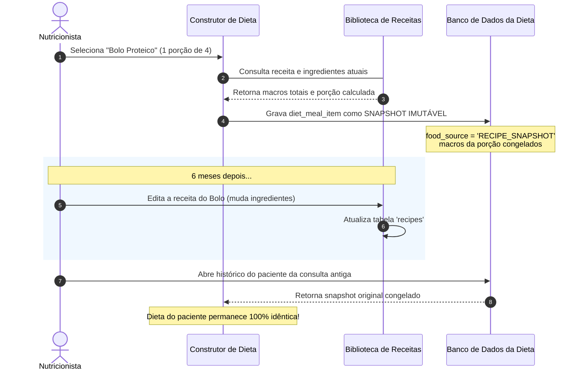

# 03. Receitas, Refeições Prontas e Imutabilidade Clínica

**Status:** Aprovado  
**Documento Anterior:** [02. Modelo de Dados e Schemas Relacionais](./02-modelo-de-dados-e-schemas.md)  
**Próximo Documento:** [04. Persistência Dual: Buffer de Rascunho e Commit ACID](./04-persistencia-local-rascunho-e-commit.md)

---

## 1. Gestão de Receitas Culinárias (`recipes`)

As receitas representam criações gastronômicas complexas desenvolvidas pelo nutricionista para prescrever opções saborosas e balanceadas aos pacientes.

### 1.1 Estrutura de uma Receita
Uma receita contém:
- **Metadados**: Nome, Categoria (ex: *Doces Fit*, *Almoço Prático*, *Shakes*), Tempo de Preparo (minutos) e Marcador de Favorito (`⭐`).
- **Rendimento (`servings`)**: Número total de porções que a receita produz (ex: `4 porções`).
- **Instruções (`instructions`)**: Texto descritivo com o passo a passo de preparo.
- **Ingredientes (`recipe_ingredients`)**: Lista de alimentos vinculados à base TACO ou Alimentos Customizados com gramatura bruta.

### 1.2 Matemática de Macronutrientes da Receita

$$\text{Total Proteína (g)} = \sum_{i=1}^{n} \text{Ingrediente}_i.\text{proteinG}$$
$$\text{Total Carboidratos (g)} = \sum_{i=1}^{n} \text{Ingrediente}_i.\text{carbsG}$$
$$\text{Total Gorduras (g)} = \sum_{i=1}^{n} \text{Ingrediente}_i.\text{fatsG}$$
$$\text{Total Kcal} = (4 \times \text{Proteína}) + (4 \times \text{Carboidratos}) + (9 \times \text{Gorduras})$$

**Porção Unitária Prescrita**:
$$\text{Macro da Porção} = \frac{\text{Total do Macro}}{\text{servings}}$$

---

## 2. Refeições Prontas / Blocos de Refeição (`ready_meals`)

Blocos de refeição são estruturas completas de prato (ex: *"Café Pós-Treino 450kcal"*) que combinam múltiplos alimentos, horários sugeridos e orientações de consumo.
- **Finalidade**: Permitir ao nutricionista montar dietas inteiras em < 2 minutos através de blocos prontos reutilizáveis.
- **Composição**: Nome, Horário Sugerido, Contagem de Itens, Preview em texto dos alimentos e payload JSON estruturado dos itens.

---

## 3. O Princípio da Imutabilidade Clínica (*Prescription Snapshot*)

### 3.1 O Problema do Vínculo Vivo
Se a dieta de um paciente apontasse apenas para o ID da receita na biblioteca mestre (`recipe_id`), qualquer alteração futura feita pelo nutricionista (ex: trocar 100g de frango por 100g de atum) alteraria **retroativamente** todas as dietas antigas que já foram entregues, violando a fidelidade do prontuário médico/nutricional.

### 3.2 A Solução: Snapshot de Prescrição

---

## 4. Integração na Exportação (PDF e WhatsApp)

Quando uma receita ou refeição em snapshot é exportada:
1. **No WhatsApp**: É formatada com o nome da porção, macros e o resumo de ingredientes ou instruções de preparo em texto limpo.
2. **No PDF Clínico**: Renderiza um bloco visual destacado com badge de receita, tabela nutricional da porção e um anexo opcional de modo de preparo ao final do plano alimentar.

---

## Próximos Passos
Entenda o mecanismo de persistência e salvamento em [04. Persistência Dual: Buffer de Rascunho e Commit ACID](./04-persistencia-local-rascunho-e-commit.md).
