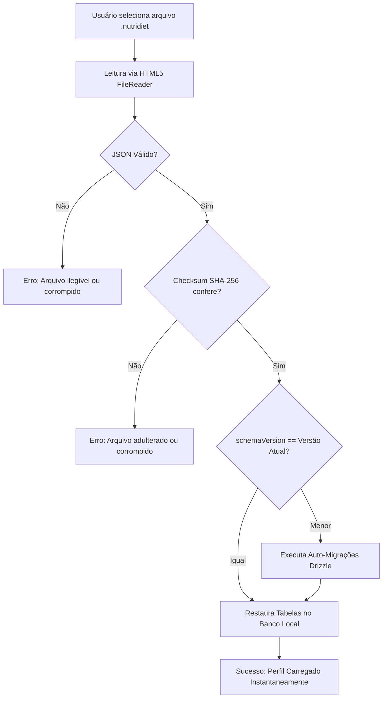

# 05. Arquivo Mestre de Perfil (.nutridiet)

**Status:** Aprovado  
**Documento Anterior:** [04. Persistência Dual: Buffer de Rascunho e Commit ACID](./04-persistencia-local-rascunho-e-commit.md)  
**Próximo Documento:** [06. Lastro Online, Fila Outbox e Migração Supabase](./06-lastro-online-outbox-e-supabase.md)

---

## 1. Conceito do Arquivo Mestre `.nutridiet`

O arquivo `.nutridiet` é o contêiner único, portável e soberano que reúne **todo o consultório do nutricionista**: perfil profissional, configurações, pacientes, histórico clínico, dietas, alimentos customizados, receitas e blocos de refeição.

---

## 2. Estrutura do Arquivo (`.nutridiet` Schema)

```json
{
  "manifest": {
    "app": "NutriDiet Local Pro",
    "version": "1.0.0",
    "schemaVersion": 1,
    "exportedAt": "2026-08-28T18:00:00.000Z",
    "checksum": "sha256-7f83b1657ff1fc53b92dc18148a1d65dfc2d4b1fa3d677284addd200126d9069",
    "nutritionist": {
      "id": "nutri-018d3e2a-7b3c-7890-a123-456789abcdef",
      "name": "Dra. Carolina Mendes",
      "crn": "CRN-3 48921",
      "email": "carolina@nutrimendes.com.br",
      "clinicName": "Clínica Mendes Nutrição Esportiva"
    }
  },
  "database": {
    "patients": [],
    "consultations": [],
    "bodyAssessments": [],
    "dietPlans": [],
    "carbCyclingVariations": [],
    "dietMeals": [],
    "dietMealItems": [],
    "customFoods": [],
    "recipes": [],
    "recipeIngredients": [],
    "readyMeals": []
  }
}
```

---

## 3. Fluxo de Importação e Validação de Integridade



---

## 4. Mecanismo de Auto-Migração de Esquemas

Se um nutricionista abrir um arquivo `.nutridiet` gerado em uma versão antiga do software (ex: `schemaVersion: 1`) em uma versão futura com novas colunas (ex: `schemaVersion: 2`):
1. O motor identifica a defasagem de versão no manifesto.
2. Executa as funções determinísticas de migração sequencial (`migration_v1_to_v2`).
3. Atualiza o banco local com o schema mais recente sem perda de dados ou necessidade de intervenção manual do usuário.

---

## 5. Política de Backups e Portabilidade

- **Sem Interrupções Intrusivas**: Não há pop-ups ou telas bloqueantes forçando backups diários automáticos.
- **Ações Sob Demanda**:
  - Botão **"Exportar Perfil / Salvar Arquivo"** no cabeçalho ou menu de configurações.
  - Botão **"Carregar Perfil"** na tela inicial ou menu para restaurar ou trocar de máquina.
- **Compatibilidade com Google Drive / OneDrive**: O arquivo `.nutridiet` salvo na pasta local do Google Drive Desktop sincroniza automaticamente com a nuvem pessoal do nutricionista.

---

## Próximos Passos
Veja como a arquitetura prepara a transição para a nuvem em [06. Lastro Online, Fila Outbox e Migração Supabase](./06-lastro-online-outbox-e-supabase.md).
