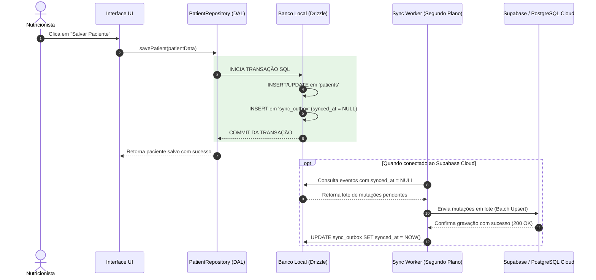

# 06. Lastro Online, Fila Outbox e Migração Supabase

**Status:** Aprovado  
**Documento Anterior:** [05. Arquivo Mestre de Perfil (.nutridiet)](./05-arquivo-mestre-perfil-nutridiet.md)  
**Próximo Documento:** [07. Segurança, Privacidade LGPD e Validação](./07-seguranca-privacidade-lgpd-e-observabilidade.md)

---

## 1. O Objetivo "Zero Retrabalho"

Um dos requisitos centrais do NutriDiet é operar hoje como uma aplicação 100% local, mas possuir um **lastro arquitetural** que permita conectar um backend em nuvem (Supabase / PostgreSQL) sem reescrever telas, formulários ou regras de negócio.

---

## 2. Padrão Outbox Transacional (`sync_outbox`)

Toda operação de escrita confirmada no banco relacional local grava atomicamente uma linha correspondente na tabela `sync_outbox`:



---

## 3. Estratégia de Identificadores (UUID v7)

- **Problema de IDs Numéricos**: Se dois computadores no consultório criarem pacientes com IDs sequenciais (`1, 2, 3`), a mesclagem na nuvem geraria colisões catastróficas.
- **Solução com UUID v7**:
  - Todo registro gerado localmente recebe um identificador único universal com carimbo de tempo (*time-ordered*).
  - A probabilidade de colisão é matematicamente nula.
  - A ordenação cronológica natural é preservada pelos índices de banco de dados no Supabase.

---

## 4. Troca Transparente de Implementação de Repositório

Como a interface consome apenas a interface `IPatientRepository`, a migração para a nuvem ocorre simplesmente alternando a injeção do repositório:

```typescript
// Contrato abstrato consumido pela UI
export interface IPatientRepository {
  getById(id: string): Promise<Patient | null>;
  save(patient: Patient): Promise<Patient>;
  delete(id: string): Promise<void>;
  listAll(): Promise<Patient[]>;
}

// Implementação Local (Hoje) -> Grava no PGlite / Drizzle Local
export class LocalSqlitePatientRepository implements IPatientRepository { ... }

// Implementação Cloud (Futuro) -> Grava no Supabase via Server Actions
export class SupabasePatientRepository implements IPatientRepository { ... }
```

**Resultado**: Nenhuma linha de código em componentes React, modais ou páginas precisa ser alterada.

---

## Próximos Passos
Veja os requisitos de conformidade e privacidade em [07. Segurança, Privacidade LGPD e Validação](./07-seguranca-privacidade-lgpd-e-observabilidade.md).
