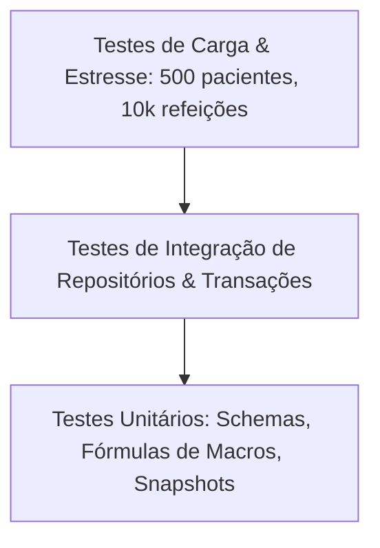

# 08. Testes, Desempenho e Homologação

**Status:** Aprovado  
**Documento Anterior:** [07. Segurança, Privacidade LGPD e Validação](./07-seguranca-privacidade-lgpd-e-observabilidade.md)  
**Próximo Documento:** [09. Roadmap de Implementação e Governança](./09-roadmap-de-migracao-e-governanca.md)

---

## 1. Pirâmide de Testes da Camada de Persistência

Para garantir que a persistência de dados seja imune a perdas, corrupções ou lentidão, a suíte de testes (Vitest) cobre:

### 1.1 Testes Unitários
- Validação de Schemas Zod com casos limite (valores negativos, strings vazias, caracteres especiais).
- Cálculo exato de macros e calorias de receitas com frações decimais e arredondamento padrão.
- Geração de UUID v7 com ordenação cronológica estrita.

### 1.2 Testes de Integração dos Repositórios
- **Atomicidade de Transação**: Simulação de erro no último item de uma refeição para verificar se o banco executa o *rollback* completo.
- **Integridade em Cascata**: Exclusão de paciente remove todas as consultas e dietas vinculadas, mantendo zero registros órfãos.
- **Imutabilidade de Snapshot**: Criação de receita -> inclusão na dieta -> alteração na receita mestre -> verificação de que a dieta do paciente permaneceu inalterada.

### 1.3 Testes de Carga e Benchmark de Performance

| Cenário de Teste | Volume de Dados | Critério de Aceite (SLA) |
| :--- | :--- | :--- |
| **Carga Massiva de Pacientes** | 500 pacientes com fotos/iniciais | Listagem com paginação em < 20ms |
| **Histórico Longo de Consultas** | 2.500 consultas e avaliações | Carregamento da timeline em < 50ms |
| **Carga de Refeições & Itens** | 10.000 refeições e 40.000 itens | Recalculo de somas de macros em < 5ms |
| **Exportação / Importação `.nutridiet`** | Base inteira com 500 pacientes | Serialização + Checksum em < 500ms |

---

## 2. Critérios de Homologação (Definition of Done - DoD)

Uma funcionalidade de banco de dados só é considerada concluída quando satisfaz:

1. **100% de Cobertura em Contratos DAL**: Todo método de repositório possui teste automatizado passando no Vitest (`npm run test`).
2. **Schema Drizzle Tipado**: Zero uso de `any` ou tipos não tipados no mapeamento de tabelas.
3. **Auditoria de Links e Integridade**: `npm run verify:links` e `npm run type-check` passam com zero erros.
4. **Proteção Contra Crash Testada**: O estado em digitação pode ser recuperado após simulação de fechamento forçado da janela.

---

## Próximos Passos
Veja o plano de fases e governança em [09. Roadmap de Implementação e Governança](./09-roadmap-de-migracao-e-governanca.md).
