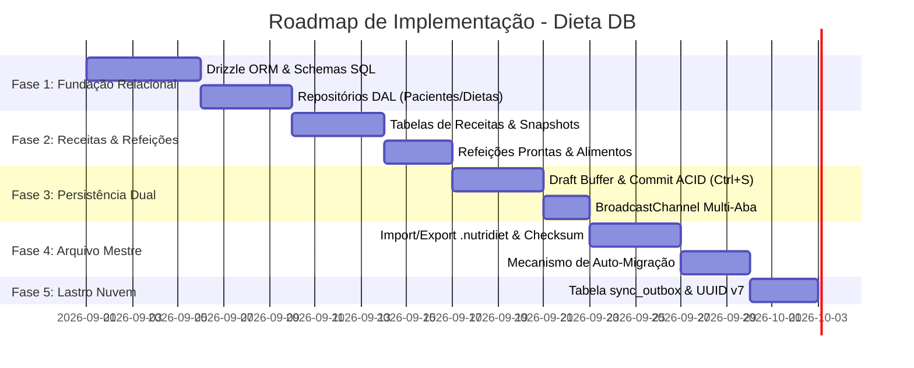

# 09. Roadmap de Implementação e Governança

**Status:** Aprovado  
**Documento Anterior:** [08. Testes, Desempenho e Homologação](./08-testes-performance-e-homologacao.md)  
**Índice Geral:** [Índice Canônico](./index.md)

---

## 1. Fases de Implementação e Entrega

A arquitetura do Dieta DB será entregue em 5 etapas progressivas e não-bloqueantes:

---

## 2. Matriz de Riscos Técnicos e Mitigações

| Risco Identificado | Impacto | Probabilidade | Estratégia de Mitigação |
| :--- | :---: | :---: | :--- |
| **Defasagem de schema entre versões do app** | Alto | Média | Versionamento semântico no manifesto e scripts de auto-migração sequenciais no Drizzle. |
| **Perda de digitação em queda de energia** | Alto | Baixa | Buffer de rascunho com salvamento contínuo em debounce (300ms). |
| **Colisão de dados ao sincronizar com nuvem** | Crítico | Baixa | Adoção estrita de UUID v7 (time-ordered) para todas as chaves primárias. |
| **Adulteração acidental do arquivo `.nutridiet`** | Médio | Média | Verificação automática de integridade por Checksum SHA-256 no momento da importação. |

---

## 3. Regras de Governança e Evolução

1. **Princípio da Fonte Única**: Nenhuma regra de persistência deve ser duplicada fora de `refs/dieta-db/` e dos ADRs oficiais (`docs/adr/`).
2. **Evolução de Schemas**: Toda nova coluna ou tabela deve:
   - Ser adicionada ao schema Drizzle (`src/lib/db/schema.ts`).
   - Gerar uma migração correspondente.
   - Incrementar o `schemaVersion` no manifesto do `.nutridiet`.
   - Incluir teste de migração regressiva na suíte de testes.
3. **Imutabilidade de Contratos DAL**: Componentes de UI não podem instanciar conexões diretas de banco de dados; toda interação deve passar por interfaces de repositório.
