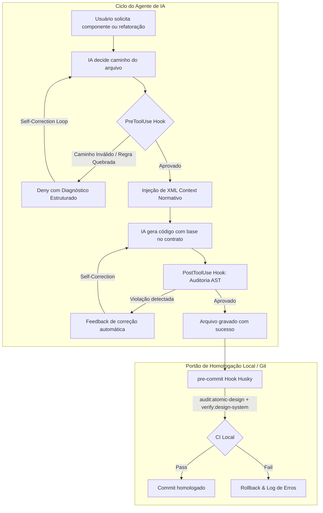

# Especificação Técnica: Hooks de Criação de Componentes (AI-First)

> **Status:** Ativo / Normativo  
> **Arquitetura:** AI-First (Otimizado para Agentes Autônomos de Codificação, LLMs e Ferramental de CI/CD)  
> **Escopo:** Interceptação Determinística, Auto-Cura (Self-Healing) e Governança no Ciclo de Vida de Componentes  
> **Compatibilidade:** Antigravity, OpenAI Codex, Claude Code, Husky/Git Hooks, AST Linters  

---

## 1. O que torna esta especificação "AI-First"?

Diferente de especificações convencionais pensadas apenas para humanos, uma especificação **AI-First** é projetada para que agentes de IA e compiladores possam consumir, validar e auto-corrigir código de forma autônoma:

```text
┌────────────────────────────────────────────────────────────────────────┐
│                        PILICAR AI-FIRST                                │
├────────────────────────────────────────────────────────────────────────┤
│ 1. Delimitadores Estruturados (XML/Tags) para Maximização de Atenção  │
│ 2. Polimorfismo de Ferramentas (Suporte a múltiplos agentes e payloads) │
│ 3. Diagnósticos Acionáveis de Auto-Cura (Self-Correction Feedback)     │
│ 4. Heurística Algorítmica de Decisão Atômica (Sem ambiguidade para LLM) │
│ 5. Contratos de Tipagem e Imports Fechados (Redução de Alucinação)     │
└────────────────────────────────────────────────────────────────────────┘
```

---

## 2. Matriz de Triggers e Camadas de Execução



---

## 3. Matriz de Decisão Heurística para Agentes de IA

Ao receber uma instrução para criar um componente de interface, o agente **DEVE** executar esta heurística de classificação de camada antes de disparar qualquer ferramenta:

| Pergunta de Avaliação | Se SIM, destino obrigatório | Exemplos |
| :--- | :--- | :--- |
| É um primitivo genérico do Radix / Shadcn sem regra de negócio? | `src/components/ui/` | `button.tsx`, `dialog.tsx`, `select.tsx`, `sheet.tsx` |
| É um elemento visual primitivo básico da marca (Level 1)? | `src/components/atoms/` | `Avatar.tsx`, `Badge.tsx`, `Button.tsx`, `Surface.tsx` |
| Combina 2+ átomos com objetivo funcional específico (Level 2)? | `src/components/molecules/` | `MacroMetricCard.tsx`, `MealItemRow.tsx`, `TacoSearchInput.tsx` |
| Gerencia uma seção inteira da UI ou múltiplos cards/tabelas (Level 3)? | `src/components/organisms/` | `SidebarNav.tsx`, `MacroTrackerHeader.tsx`, `MealCardContainer.tsx` |
| É uma casca/skeleton estrutural de layout de tela inteira (Level 4)? | `src/components/templates/` | `DashboardLayoutTemplate.tsx`, `PatientDetailTemplate.tsx` |

---

## 4. Hook do Agente: `PreToolUse` (Interceptação Pré-Escrita)

### 4.1 Mapeamento Polimórfico de Ferramentas (Multi-Agent Support)
O hook normaliza os diferentes payloads recebidos por Antigravity, Codex ou Claude Code:

| Runtime / Engine | Ferramenta Interceptada | Campo de Destino (`TargetFile`) | Campo de Código (`CodeContent`) |
| :--- | :--- | :--- | :--- |
| **Antigravity** | `write_to_file`, `replace_file_content` | `tool_input.TargetFile` | `tool_input.CodeContent` |
| **Codex** | `apply_patch`, `Write`, `Edit` | `tool_input.path` / `file_path` | `tool_input.content` / `patch` |
| **Claude Code** | `Write`, `Edit`, `MultiEdit` | `tool_input.file_path` | `tool_input.content` |

---

### 4.2 Formato do Contexto Injetado na IA (`additionalContext`)
O hook formata a resposta usando tags semânticas para maximizar o foco dos mecanismos de atenção dos LLMs:

```xml
<component_governance_contract layer="MOLECULES">
  <target_file>src/components/molecules/MacroMetricCard.tsx</target_file>
  <mandatory_rules>
    1. EXPORT_INTERFACE: É obrigatório exportar "export interface MacroMetricCardProps extends React.HTMLAttributes<HTMLDivElement>".
    2. CLASSNAME_MERGE: É obrigatório aceitar "className?: string" e mesclar via "cn(..., className)".
    3. ZERO_HEX_COLORS: Estritamente proibido hex (#fff, #2746B3). Use tokens (text-primary, bg-surface, text-muted-foreground).
    4. NO_ARBITRARY_TAILWIND: Proibido classes do tipo "p-[13px]" ou "w-[123px]". Use a escala múltipla de 4px (p-3, p-4, w-32).
    5. LAYER_DEPENDENCY_RULE: Moléculas podem importar de "atoms", "ui" e "lib/utils". NÃO podem importar de "organisms", "templates" ou "app".
  </mandatory_rules>
  <gold_standard_template>
    <![CDATA[
    import * as React from "react";
    import { cn } from "@/lib/utils";

    export interface MacroMetricCardProps extends React.HTMLAttributes<HTMLDivElement> {
      label: string;
      value: number | string;
      unit?: string;
    }

    export const MacroMetricCard = React.forwardRef<HTMLDivElement, MacroMetricCardProps>(
      ({ className, label, value, unit = "g", ...props }, ref) => {
        return (
          <div
            ref={ref}
            className={cn("flex flex-col gap-1 p-3 rounded-lg bg-surface border border-border", className)}
            {...props}
          >
            <span className="text-xs font-medium text-muted-foreground">{label}</span>
            <div className="flex items-baseline gap-1">
              <span className="text-lg font-semibold text-foreground">{value}</span>
              <span className="text-xs text-muted-foreground">{unit}</span>
            </div>
          </div>
        );
      }
    );

    MacroMetricCard.displayName = "MacroMetricCard";
    ]]>
  </gold_standard_template>
</component_governance_contract>
```

---

### 5. Diagnósticos Estruturados para Auto-Cura (Self-Correction Protocol)

Quando o hook rejeita (`permissionDecision: "deny"`), a mensagem é formatada como um **objeto de autocorreção** para que o LLM entenda o erro de forma determinística:

#### Exemplo de Resposta de Bloqueio (Auto-Healing Diagnostic)
```json
{
  "hookSpecificOutput": {
    "hookEventName": "PreToolUse",
    "permissionDecision": "deny",
    "permissionDecisionReason": "CRITICAL_VIOLATION_REPORT:\n{\n  \"error_code\": \"ERR_PROHIBITED_HEX_COLOR\",\n  \"violating_file\": \"src/components/molecules/MacroMetricCard.tsx\",\n  \"detected_value\": \"#2746B3\",\n  \"reason\": \"Hexadecimal hardcoded proíbe o suporte a temas e consistência de tokens.\",\n  \"actionable_fix\": \"Substitua '#2746B3' por 'bg-primary' ou 'text-primary' conforme o design system tokens-reference.md.\"\n}"
  }
}
```

---

## 6. Código de Referência Otimizado: `component_guard.py`

Este script Python implementa o parser polimórfico, as validações de AST em tempo real e a injeção do contrato XML:

```python
#!/usr/bin/env python3
"""
NutriDiet Local Pro - AI-First Component Governance Hook
Intercepta criação/edição de componentes e injeta contratos normativos diretamente no LLM.
"""

import json
import re
import sys
from typing import Dict, Any, Optional

VALID_LAYERS = {
    "ui": "Primitivos Radix/Shadcn sem acoplamento de negócio",
    "atoms": "Componentes visuais elementares da marca NutriDiet (Level 1)",
    "molecules": "Combinações funcionais de átomos para o domínio (Level 2)",
    "organisms": "Seções complexas de interface e containers (Level 3)",
    "templates": "Estruturas e esqueletos de layout de páginas (Level 4)",
}

def extract_file_and_code(payload: Dict[str, Any]) -> tuple[Optional[str], str]:
    tool_input = payload.get("tool_input", {})
    # Suporte a múltiplos nomes de parâmetros entre agentes
    target_file = (
        tool_input.get("TargetFile") or
        tool_input.get("path") or
        tool_input.get("file_path") or
        tool_input.get("filePath") or
        ""
    )
    code_content = (
        tool_input.get("CodeContent") or
        tool_input.get("content") or
        tool_input.get("patch") or
        tool_input.get("ReplacementContent") or
        ""
    )
    return target_file, code_content

def build_error_response(error_code: str, file_path: str, message: str, fix: str) -> str:
    report = {
        "error_code": error_code,
        "violating_file": file_path,
        "reason": message,
        "actionable_fix": fix
    }
    return json.dumps({
        "hookSpecificOutput": {
            "hookEventName": "PreToolUse",
            "permissionDecision": "deny",
            "permissionDecisionReason": f"AI_GOVERNANCE_VIOLATION:\n{json.dumps(report, indent=2)}"
        }
    })

def main():
    try:
        payload = json.load(sys.stdin)
    except Exception:
        sys.exit(0)

    target_file, code_content = extract_file_and_code(payload)
    if not target_file:
        sys.exit(0)

    normalized = target_file.replace("\\", "/").lower()

    # 1. Filtro: Aplica-se apenas a arquivos TSX dentro de components
    if "src/components/" not in normalized or not normalized.endswith(".tsx"):
        sys.exit(0)

    # 2. Bloqueio: Proibição de arquivos soltos na raiz src/components/
    if re.search(r"src/components/[^/]+\.tsx$", normalized):
        print(build_error_response(
            "ERR_ROOT_DIRECTORY_PLACEMENT",
            target_file,
            "Componentes não podem ser criados diretamente na raiz 'src/components/'.",
            "Mova o componente para 'atoms/', 'molecules/', 'organisms/', 'templates/' ou 'ui/'."
        ))
        sys.exit(0)

    # 3. Identifica a camada atômica
    layer_match = re.search(r"src/components/([^/]+)/", normalized)
    current_layer = layer_match.group(1) if layer_match else ""

    if current_layer not in VALID_LAYERS:
        sys.exit(0)

    # 4. Validações estáticas de código (quando fornecido)
    if code_content:
        # A. Proibição de Cores Hexadecimais Hardcoded
        hex_match = re.search(r"#(?:[0-9a-fA-F]{3}){1,2}\b", code_content)
        if hex_match:
            print(build_error_response(
                "ERR_PROHIBITED_HEX_COLOR",
                target_file,
                f"Cor HEX hardcoded '{hex_match.group(0)}' detectada.",
                "Substitua pelo token Tailwind correspondente (ex: bg-primary, text-muted-foreground, bg-surface)."
            ))
            sys.exit(0)

        # B. Proibição de Vazamento de Domínio em Átomos e UI
        if current_layer in ["atoms", "ui"]:
            domain_leak = re.search(r"from\s+['\"].*(@/data/|paciente|refeicao|taco).*['\"]", code_content, re.IGNORECASE)
            if domain_leak:
                print(build_error_response(
                    "ERR_DOMAIN_LEAK_IN_PRIMITIVE",
                    target_file,
                    f"A camada '{current_layer}' é estritamente genérica e não pode importar tipos/dados de domínio.",
                    "Remova imports de entidades de nutrição/paciente desta camada. Mova o componente para 'molecules/' ou 'organisms/' se precisar de dados de domínio."
                ))
                sys.exit(0)

    # 5. Injeção de Contexto Estruturado (XML AI-First)
    xml_context = f"""
<component_governance_contract layer="{current_layer.upper()}">
  <target_file>{target_file}</target_file>
  <layer_purpose>{VALID_LAYERS[current_layer]}</layer_purpose>
  <mandatory_guidelines>
    - Respeite 'agents.md' e '.agents/rules/atomic-design.md'.
    - Exporte 'interface [ComponentName]Props' estendendo atributos HTML nativos.
    - Aceite 'className?: string' e aplique com 'cn(..., className)'.
    - Proibido cores HEX (#fff) e utilitários arbitrários (p-[13px]).
    - Use 'React.forwardRef' para elementos interativos.
  </mandatory_guidelines>
</component_governance_contract>
""".strip()

    response = {
        "hookSpecificOutput": {
            "hookEventName": "PreToolUse",
            "additionalContext": xml_context
        }
    }
    print(json.dumps(response))
    sys.exit(0)

if __name__ == "__main__":
    main()
```

---

## 7. Configuração no `.codex/hooks.json`

```json
{
  "description": "Governança AI-First de Componentes do Design System",
  "hooks": {
    "PreToolUse": [
      {
        "matcher": ".*",
        "hooks": [
          {
            "type": "command",
            "command": "python \".codex/hooks/component_guard.py\"",
            "commandWindows": "python \".codex/hooks/component_guard.py\"",
            "timeout": 15,
            "statusMessage": "Injetando contrato de governança de componentes no agente..."
          }
        ]
      }
    ]
  }
}
```

---

## 8. Verificação e Testabilidade do Hook

Para testar o script e garantir que o pipeline de IA está funcionando:

```bash
# Teste 1: Simular criação válida em molecules
echo '{"tool_name":"write_to_file","tool_input":{"TargetFile":"src/components/molecules/TestCard.tsx","CodeContent":"export const TestCard = () => <div />;"}}' | python .codex/hooks/component_guard.py

# Teste 2: Simular tentativa de cor Hex (deve retornar deny com JSON estruturado)
echo '{"tool_name":"write_to_file","tool_input":{"TargetFile":"src/components/atoms/TestBadge.tsx","CodeContent":"const color = \"#2746B3\";"}}' | python .codex/hooks/component_guard.py

# Teste 3: Simular criação na raiz (deve retornar deny com ERR_ROOT_DIRECTORY_PLACEMENT)
echo '{"tool_name":"write_to_file","tool_input":{"TargetFile":"src/components/TestRoot.tsx","CodeContent":"export const Test = () => null;"}}' | python .codex/hooks/component_guard.py
```
