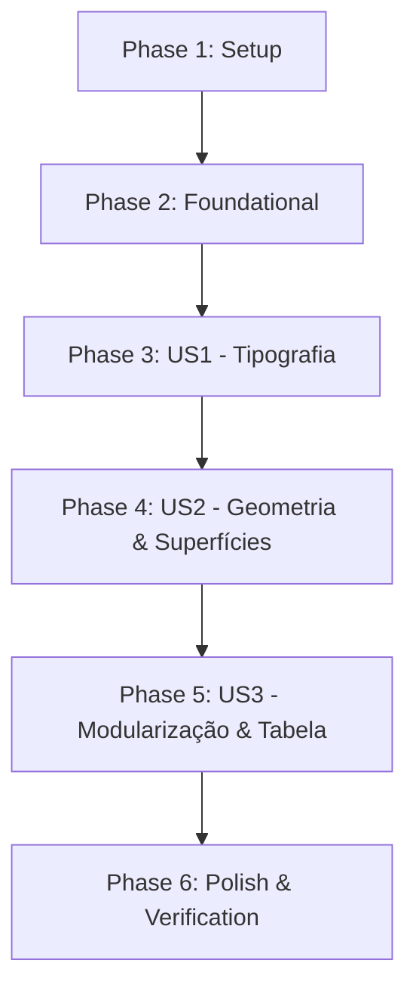

# Tasks: Correção de Conformidade 100% ao Design System na Página de Perfil do Paciente (/pacientes/perfil)

**Input**: Design documents from `/specs/07-08-26-correcao-ds-perfil-paciente/`

**Prerequisites**: plan.md (required), spec.md (required for user stories), research.md, data-model.md, quickstart.md

---

## Phase 1: Setup & Foundational Infrastructure

**Purpose**: Verificação de ambiente e isolamento de utilitários e tipos compartilhados

- [ ] T001 [skill: design-system] Validar índice de tokens e contratos de tipografia em `src/design-system/text-styles.ts` e `src/design-system/tokens.css`
- [ ] T002 [P] [skill: general] Verificar compilação e suíte de testes existente executando `npm test`

---

## Phase 2: Foundational Components (Blocking Prerequisites)

**Purpose**: Definição dos contratos de componentes de apresentação para o Perfil do Paciente

- [ ] T003 [P] [skill: frontend-design] Criar os tipos e contratos das moléculas e organismos do perfil do paciente em `src/components/molecules/index.ts` e `src/components/organisms/index.ts`

---

## Phase 3: User Story 1 - Normalização Tipográfica e Text Styles (Priority: P1) 🎯 MVP

**Goal**: Eliminar todas as combinações ad-hoc de `font-bold`, `font-semibold` e `tracking-tight` com `textStyle(...)` e substituir o uso indevido de `text-style-legal` por tokens semânticos (`caption`, `body-secondary`, `helper`).

**Independent Test**: Inspecionar os textos do Perfil do Paciente e confirmar que todos utilizam `textStyle(...)` canônico sem sobrescritas de peso de fonte.

- [ ] T004 [P] [US1] [skill: frontend-design] Refatorar cabeçalho do resumo do paciente em `src/app/pacientes/[id]/page.tsx` para usar `textStyle('subsection-title')` sem `font-bold` nem `tracking-tight`
- [ ] T005 [P] [US1] [skill: frontend-design] Normalizar os títulos de seção "Indicadores atuais" e "Plano alimentar atual" em `src/app/pacientes/[id]/page.tsx` com `textStyle('section-title')` e `textStyle('subsection-title')`
- [ ] T006 [US1] [skill: frontend-design] Substituir o uso indevido de `text-style-legal` em descrições de seções e badges em `src/app/pacientes/[id]/page.tsx` por `textStyle('body-secondary')` e `textStyle('caption')`
- [ ] T007 [P] [US1] [skill: frontend-design] Corrigir tipografia dos modais existentes `src/components/molecules/EditAssessmentModal.tsx`, `src/components/molecules/EditPatientModal.tsx` e `src/components/molecules/ReadOnlyDietModal.tsx` garantindo conformidade aos tokens de `textStyle(...)`

---

## Phase 4: User Story 2 - Respeito à Geometria, Espaçamentos e Superfícies (Priority: P2)

**Goal**: Garantir que botões, avatares e contêineres sigam as dimensões autorizadas (`compact` 32px e `standard` 36px) e o padrão de superfície `Surface`.

**Independent Test**: Verificar que `Avatar` e `IconButton` não possuem classes Tailwind de altura/largura arbitrárias e que o bloco "Próximo Acompanhamento" utiliza `Surface`.

- [ ] T008 [P] [US2] [skill: anti-ai-slop-design] Remover dimensões arbitrárias (`h-16 w-16` em Avatar, `h-7 w-7` em IconButton, `h-6 w-px` em divisores) no arquivo `src/app/pacientes/[id]/page.tsx`
- [ ] T009 [US2] [skill: frontend-design] Padronizar o bloco de "Próximo acompanhamento" em `src/app/pacientes/[id]/page.tsx` utilizando a abstração `Surface` e tokens semânticos de cor
- [ ] T010 [P] [US2] [skill: frontend-design] Adequar espaçamentos internos e paddings das seções de `src/app/pacientes/[id]/page.tsx` usando exclusivamente tokens de espaçamento (`gap-3`, `gap-4`, `gap-6`, `p-6`)

---

## Phase 5: User Story 3 - Desacoplamento Arquitetural & Modularização (Priority: P3)

**Goal**: Extrair a tabela bruta de histórico de consultas e os modais inline da página `src/app/pacientes/[id]/page.tsx` para organismos e moléculas reutilizáveis, eliminando imports de `@/components/ui/` na página.

**Independent Test**: Confirmar que `src/app/pacientes/[id]/page.tsx` não importa `@/components/ui/` diretamente e não contém marcações `<table>` brutas.

- [ ] T011 [P] [US3] [skill: frontend-design] Criar o organismo `PatientConsultationHistoryTable` em `src/components/organisms/PatientConsultationHistoryTable.tsx` integrando visualização de consultas, dados dietéticos, corporais e acordeão expansível
- [ ] T012 [P] [US3] [skill: frontend-design] Extrair a molécula `NextEventModal` para `src/components/molecules/NextEventModal.tsx` com form de reagendamento e seleção de data/tipo
- [ ] T013 [P] [US3] [skill: frontend-design] Extrair a molécula `AddObjectiveModal` para `src/components/molecules/AddObjectiveModal.tsx` para cadastro de objetivos customizados
- [ ] T014 [P] [US3] [skill: frontend-design] Extrair a molécula `DeletePatientModal` para `src/components/molecules/DeletePatientModal.tsx` para confirmação de exclusão
- [ ] T015 [US3] [skill: frontend-design] Refatorar `src/app/pacientes/[id]/page.tsx` substituindo o código solto pelas moléculas/organismos extraídos e removendo 100% dos imports diretos de `@/components/ui/`

---

## Phase 6: Polish & Verification

**Purpose**: Verificação de qualidade estática e validação de regressão zero

- [ ] T016 [P] [skill: webapp-testing] Executar a suíte completa de testes automatizados com `npm test`
- [ ] T017 [skill: speckit-analyze] Executar auditoria final de conformidade e verificação estática de tipos e lints no repositório

---

## Dependencies & Execution Order

### Parallel Opportunities

- **US1 Tasks**: T004, T005, T007 podem ser executadas em paralelo.
- **US2 Tasks**: T008 e T010 podem ser executadas em paralelo.
- **US3 Tasks**: T011, T012, T013, T014 podem ser desenvolvidas em paralelo por se tratarem de componentes em arquivos isolados.
