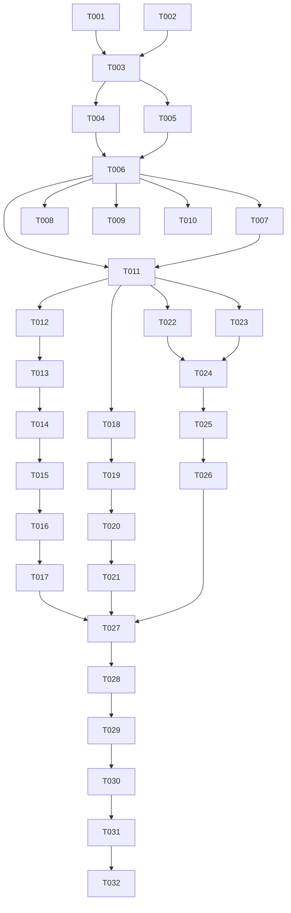

# Tasks: Padronização de Tabelas com Shadcn DataTable

**Input**: Design documents from `/specs/07-08-26-data-table-shadcn/`

**Prerequisites**: [plan.md](plan.md), [spec.md](spec.md), [research.md](research.md), [data-model.md](data-model.md), [contracts/data-table.md](contracts/data-table.md)

**Execution**: This plan must be executed through `/speckit-implement` after human approval.

## Implementation Strategy

Implementar primeiro a molécula genérica e seu contrato, depois migrar os três consumidores em fatias independentes. Os testes de cada fatia devem ser escritos ou ajustados antes da implementação correspondente. A remoção do TanStack acontece no setup, mas a auditoria final confirma que nenhum vestígio permanece.

- **Phase 1 (Setup)**: auditar consumidores, capturar baseline e remover a dependência externa.
- **Phase 2 (Foundational / US1)**: criar, testar e registrar o DataTable compartilhado.
- **Phase 3 (US2)**: migrar alimentos, incluindo ordenação e paginação.
- **Phase 4 (US3)**: migrar lista de pacientes, preservando navegação e teclado.
- **Phase 5 (US4)**: migrar histórico de consultas, preservando expansão e ações.
- **Phase 6 (Polish)**: executar auditorias, testes, verificadores e QA desktop.

---

## Phase 1: Setup (Shared Infrastructure)

**Purpose**: Confirmar o escopo real e remover a infraestrutura externa antes da nova composição.

- [ ] T001 [skill: general] Auditar todos os consumidores de tabela em `src/` e registrar o resultado em `specs/07-08-26-data-table-shadcn/research.md`, separando `src/components/ui/table.tsx` e exemplos de catálogo dos consumidores de domínio.
- [ ] T002 [P] [skill: tdd] Executar o baseline dos testes atuais relacionados a tabelas em `tests/components/organisms/patient-list-table.test.tsx`, `tests/app/pacientes/page.test.tsx`, `tests/app/pacientes/patient-profile-history.test.tsx` e `tests/app/pacientes/patient-profile-visual.spec.ts` antes das alterações.
- [ ] T003 [skill: general] Remover `@tanstack/react-table` com o gerenciador de pacotes, atualizando somente `package.json` e `package-lock.json`; os imports/tipos consumidores serão removidos nas tarefas de migração para evitar uma quebra intermediária sem contexto.

**Checkpoint**: A auditoria confirma os consumidores e o repositório não instala mais a biblioteca externa.

---

## Phase 2: Foundational - User Story 1 (Priority: P1) 🎯 MVP

**Goal**: Entregar o DataTable compartilhado com contrato genérico, estados acessíveis e registro no Design System.

**Independent Test**: `tests/components/molecules/data-table.test.tsx` comprova caption, headers, células, estados, ordenação, paginação, chaves estáveis e expansão sem importar tipos de domínio.

### Tests for User Story 1 (write first)

- [ ] T004 [skill: tdd] [US1] Criar testes de contrato em `tests/components/molecules/data-table.test.tsx` cobrindo caption acessível, `scope="col"`, células tipadas, estado vazio, loading, erro, read-only e ausência de imports de domínio.
- [ ] T005 [skill: tdd] [US1] Estender `tests/components/molecules/data-table.test.tsx` com ordenação controlada, paginação, ciclo de direção, disabled states, row renderer e expanded row antes da implementação.

### Implementation for User Story 1

- [ ] T006 [skill: shadcn] [US1] Implementar `src/components/molecules/DataTable.tsx` usando apenas `Table`, `TableCaption`, `TableHeader`, `TableHead`, `TableBody`, `TableRow` e `TableCell` de `src/components/ui/table.tsx`, com API genérica de `data-model.md`, estados, chaves estáveis, ordenação, paginação e renderização de linhas complexas.
- [ ] T007 [skill: shadcn] [US1] Exportar `DataTable`, `DataTableProps`, `DataTableColumnDef`, `DataTableSortState` e tipos relacionados em `src/components/molecules/index.ts` sem expor tipos de domínio.
- [ ] T008 [P] [skill: design-system] [US1] Criar o perfil `design-system/components/profiles/molecules/data-table.md` herdando `data-display`, documentando identidade, anatomia, API, estados, acessibilidade, composição e consumidores.
- [ ] T009 [P] [skill: design-system] [US1] Criar o perfil `design-system/components/profiles/organisms/food-table-section.md` para o consumidor de alimentos, herdando `data-display` e documentando ordenação, paginação, ações e estados.
- [ ] T010 [skill: design-system] [US1] Registrar `molecule-data-table`, `organism-food-table-section` e seus consumidores em `design-system/components/registry.json`, mantendo `ui-table` e seu perfil inalterados.
- [ ] T011 [skill: tdd] [US1] Executar `tests/components/molecules/data-table.test.tsx` e corrigir o contrato até todos os cenários da US1 passarem sem alterar `src/components/ui/table.tsx`.

**Checkpoint**: O DataTable genérico está testado, exportado e registrado; as histórias de consumidor podem começar em paralelo.

---

## Phase 3: User Story 2 - Tabela de alimentos (Priority: P2)

**Goal**: Migrar alimentos para o DataTable mantendo filtros, ordenação, paginação, favoritos e edição.

**Independent Test**: `tests/components/organisms/foods/food-table-section.test.tsx` cobre filtros já aplicados, ordenação por coluna, limites de página, empty state e isolamento das ações de linha.

### Tests for User Story 2 (write first)

- [ ] T012 [P] [skill: tdd] [US2] Criar `tests/components/organisms/foods/food-table-section.test.tsx` com fixtures de alimentos e cenários de renderização, empty state, favoritos e edição antes da migração.
- [ ] T013 [skill: tdd] [US2] Adicionar ao teste de `FoodTableSection` cenários de ordenação ascendente/descendente, paginação de 15 linhas, filtros preservados e controles disabled nas bordas.

### Implementation for User Story 2

- [ ] T014 [skill: shadcn] [US2] Refatorar `src/components/organisms/foods/useFoodTableColumns.tsx` para exportar colunas `DataTableColumnDef<FoodItem>`, mantendo botões, badges, unidades, ícones, callbacks de favorito/edição e valores ordenáveis.
- [ ] T015 [skill: shadcn] [US2] Refatorar `src/components/organisms/foods/FoodTableSection.tsx` para usar `DataTable`, remover `useReactTable`/`flexRender`, fornecer caption, empty state, paginação de 15 itens e controles acessíveis.
- [ ] T016 [skill: frontend-architecture-mindset] [US2] Atualizar `src/hooks/useFoodSearchPage.ts` para remover `SortingState` de TanStack e usar o estado genérico do DataTable, preservando filtro antes de ordenação e reset/clamp da página quando o conjunto mudar.
- [ ] T017 [skill: tdd] [US2] Executar `tests/components/organisms/foods/food-table-section.test.tsx` e corrigir regressões de filtros, ordenação, paginação, favoritos, edição e propagação de eventos.

**Checkpoint**: `/alimentos` usa somente o DataTable e passa sua suíte independente.

---

## Phase 4: User Story 3 - Lista de pacientes (Priority: P2)

**Goal**: Migrar a tabela de pacientes preservando prioridade, indicadores, links e navegação por teclado.

**Independent Test**: `tests/components/organisms/patient-list-table.test.tsx` e `tests/app/pacientes/page.test.tsx` continuam aprovando conteúdo, estados de busca e ativação por mouse/Enter/Espaço.

### Tests for User Story 3 (write first)

- [ ] T018 [P] [skill: tdd] [US3] Atualizar `tests/components/organisms/patient-list-table.test.tsx` para afirmar o uso do contrato DataTable, caption, headers, row renderer, links reais e ausência de navegação duplicada antes da refatoração.

### Implementation for User Story 3

- [ ] T019 [skill: shadcn] [US3] Refatorar `src/components/organisms/PatientListTable.tsx` para substituir o shell manual por `DataTable`, mantendo headers, caption, ordem recebida e estados vazios da página.
- [ ] T020 [skill: shadcn] [US3] Adaptar `src/components/organisms/patient/PatientListTableRow.tsx` ao contrato de linha do DataTable, preservando indicadores, prioridade, link de perfil, chevron, foco visível e Enter/Espaço.
- [ ] T021 [skill: tdd] [US3] Executar `tests/components/organisms/patient-list-table.test.tsx` e `tests/app/pacientes/page.test.tsx`, corrigindo qualquer regressão de semântica, teclado, busca e ações internas.

**Checkpoint**: `/pacientes` mantém os fluxos existentes e sua tabela é fornecida pelo DataTable compartilhado.

---

## Phase 5: User Story 4 - Histórico de consultas (Priority: P2)

**Goal**: Migrar o histórico para o DataTable preservando expansão por data e ações de consulta, dieta e avaliação.

**Independent Test**: `tests/app/pacientes/patient-profile-history.test.tsx` e `tests/app/pacientes/patient-profile-visual.spec.ts` cobrem caption, rows, expansão, ações e empty state.

### Tests for User Story 4 (write first)

- [ ] T022 [P] [skill: tdd] [US4] Atualizar `tests/app/pacientes/patient-profile-history.test.tsx` para afirmar expansão/recolhimento, sublinha associada, ações independentes e estado sem histórico antes da migração.
- [ ] T023 [P] [skill: tdd] [US4] Atualizar `tests/app/pacientes/patient-profile-visual.spec.ts` para validar caption, headers, quantidade de controles de expansão e hierarquia desktop do histórico.

### Implementation for User Story 4

- [ ] T024 [skill: shadcn] [US4] Refatorar `src/components/organisms/PatientConsultationHistoryTable.tsx` para usar `DataTable`, mantendo caption, contagem, estado vazio, estado controlado de data expandida e headers.
- [ ] T025 [skill: shadcn] [US4] Adaptar `src/components/organisms/patient/ConsultationHistoryRow.tsx` ao row/expanded-row contract do DataTable, preservando cinco células, sublinha com `colSpan`, ações internas, `aria-expanded` e callbacks de dieta/avaliação.
- [ ] T026 [skill: tdd] [US4] Executar `tests/app/pacientes/patient-profile-history.test.tsx` e `tests/app/pacientes/patient-profile-visual.spec.ts`, corrigindo regressões de expansão, links, botões e estados vazios.

**Checkpoint**: `/pacientes/[id]` usa o DataTable e mantém o histórico expansível e acessível.

---

## Phase 6: Polish & Cross-Cutting Concerns

**Purpose**: Validar a migração completa contra spec, Design System, acessibilidade e qualidade do projeto.

- [ ] T027 [skill: general] Auditar `src/`, `package.json` e `package-lock.json` com `rg` para confirmar zero `@tanstack/react-table`, `useReactTable` e `react-table`, e confirmar que todos os consumidores de tabela foram migrados.
- [ ] T028 [skill: design-system] Executar `npm run verify:design-system`, `npm run verify:links` e `npm run audit:atomic-design`, corrigindo divergências no perfil/registry e nas camadas sem alterar o primitivo `src/components/ui/table.tsx`.
- [ ] T029 [skill: tdd] Executar `npm run test` e confirmar cobertura dos contratos DataTable, alimentos, pacientes e histórico sem testes flakey ou mutação global indevida.
- [ ] T030 [skill: general] Executar `npm run type-check`, `npm run lint` e `npm run build`, corrigindo todos os erros de tipos, lint ou compilação gerados pela migração.
- [ ] T031 [skill: webapp-testing] Executar os cenários desktop de `specs/07-08-26-data-table-shadcn/quickstart.md` em `/alimentos`, `/pacientes` e `/pacientes/[id]`, verificando teclado, foco, estados, ordenação, paginação, expansão e ausência de novas requisições de rede em viewport a partir de 1024px.
- [ ] T032 [skill: code-reviewer-expert] Revisar o diff final contra `spec.md`, `plan.md`, `data-model.md`, `contracts/data-table.md`, `design-system/components/categories/data-display.md` e as regras `.agents/rules/`, documentando e corrigindo qualquer violação antes de marcar a feature concluída.

---

## Dependencies & Execution Order

### Phase dependencies

- Setup T001–T003 precede the shared component.
- Foundational US1 T004–T011 blocks all consumer migrations.
- US2, US3 and US4 depend on T011 but can be executed in parallel when separate ownership is available; within each story, tests precede implementation.
- Polish T027–T032 starts only after all three consumers pass their checkpoints.

### Parallel opportunities

- T001 and T002 are independent read-only/baseline activities.
- T004 and T005 must be authored sequentially because they touch the same test file.
- T008 and T009 can run in parallel after the DataTable API is fixed, with each changing a separate catalog artifact.
- T012, T018, T022 and T023 can be prepared in parallel after the shared contract exists.
- US2, US3 and US4 implementation phases can be staffed in parallel after T011, but files within a story remain sequential.

## Notes

- `[P]` means the task is parallelizable only when it does not overlap an active file edit.
- Every task has exactly one `[skill: ...]` assignment immediately after its ID, using a skill available in the session or `[skill: general]` when no specialized skill is a better fit.
- `src/components/ui/table.tsx` is intentionally not a task target; modifying it would violate the preservation rules.
