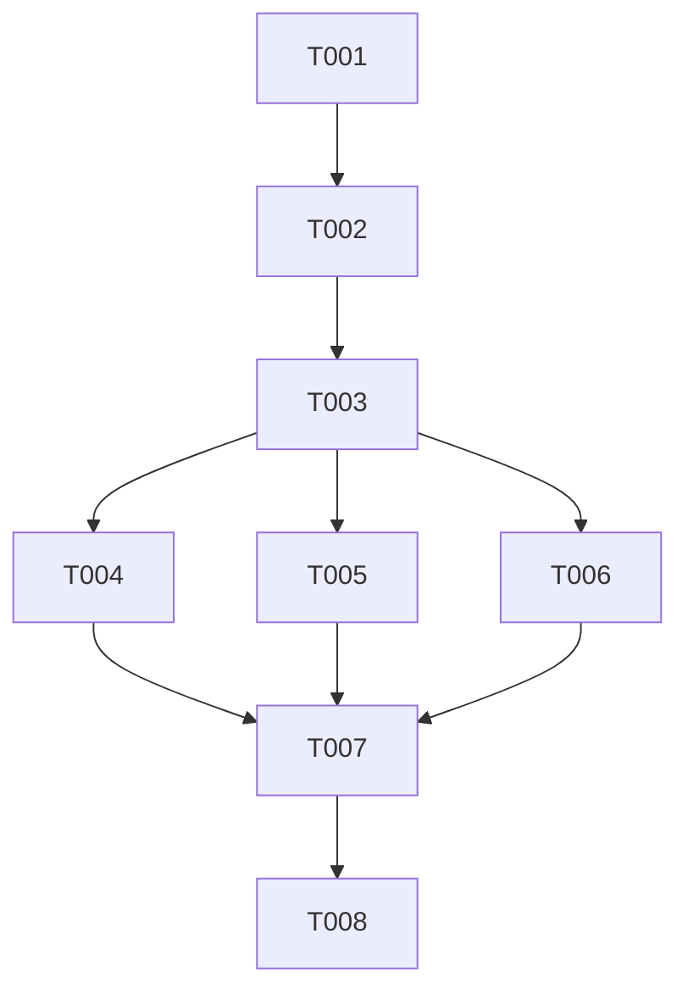

# Tasks: Padronização de Tabelas com Shadcn Data Table

**Feature**: [spec.md](spec.md) | **Plan**: [plan.md](plan.md) | **Date**: 2026-08-07

## Implementation Strategy

Refatorar a infraestrutura de tabelas da aplicação substituindo a biblioteca `@tanstack/react-table` por um componente reutilizável `DataTable` derivado unicamente de `@/components/ui/table`.

- **Phase 1 (Setup & Uninstallation)**: Desinstalar `@tanstack/react-table` e purgar referências mortas.
- **Phase 2 (Foundational)**: Criar o componente genérico `DataTable` em `src/components/ui/data-table.tsx`.
- **Phase 3 (User Story 1 - Food Table Conversion)**: Migrar `FoodTableSection.tsx` para o `DataTable`.
- **Phase 4 (User Story 2 - Patient List Conversion)**: Migrar `PatientListTable.tsx` para o `DataTable`.
- **Phase 5 (User Story 3 - Patient Consultation History Conversion)**: Migrar `PatientConsultationHistoryTable.tsx` para o `DataTable`.
- **Phase 6 (Polish & Verification)**: Executar checagens de build, navegação e linters.

---

## Phase 1: Setup & Uninstallation

- [ ] T001 [skill: general] Desinstalar a biblioteca `@tanstack/react-table` via `npm uninstall @tanstack/react-table` em `package.json`
- [ ] T002 [skill: general] [P] Remover arquivo legado `src/components/organisms/foods/useFoodTableColumns.tsx` e purgar tipagens de `SortingState` de `src/hooks/useFoodSearchPage.ts`

---

## Phase 2: Foundational Component

- [ ] T003 [skill: shadcn] Criar o componente genérico `DataTable` em `src/components/ui/data-table.tsx` utilizando exclusivamente primitivos `@/components/ui/table` com suporte a colunas tipadas, callback de clique em linhas e estado vazio.

---

## Phase 3: User Story 1 - Conversão da Tabela de Alimentos (`/alimentos`)

**Goal**: Permitir a visualização e filtragem de alimentos utilizando o novo componente `DataTable` sem biblioteca externa.
**Independent Test**: Acessar `/alimentos`, buscar por alimento e ordenar mantendo o comportamento de busca e layout.

- [ ] T004 [skill: shadcn] [US1] Refatorar `src/components/organisms/foods/FoodTableSection.tsx` substituindo `useReactTable` e `@tanstack/react-table` pela invocação do componente `DataTable` de `src/components/ui/data-table.tsx`.

---

## Phase 4: User Story 2 - Conversão da Tabela de Pacientes (`/pacientes`)

**Goal**: Padronizar a lista de pacientes com o componente `DataTable`.
**Independent Test**: Acessar `/pacientes` e navegar para o perfil de um paciente via clique na linha.

- [ ] T005 [skill: shadcn] [US2] Refatorar `src/components/organisms/PatientListTable.tsx` substituindo a marcação manual de linhas pelo componente `DataTable` de `src/components/ui/data-table.tsx`.

---

## Phase 5: User Story 3 - Conversão da Tabela de Histórico de Consultas (`/pacientes/[id]`)

**Goal**: Padronizar o histórico de consultas na visualização de perfil de paciente com o componente `DataTable`.
**Independent Test**: Acessar `/pacientes/[id]` e expandir/visualizar o histórico de consultas do paciente.

- [ ] T006 [skill: shadcn] [US3] Refatorar `src/components/organisms/PatientConsultationHistoryTable.tsx` e `src/components/organisms/patient/ConsultationHistoryRow.tsx` para integrar com o componente `DataTable` de `src/components/ui/data-table.tsx`.

---

## Phase 6: Polish & Verification

- [ ] T007 [skill: general] Executar `npm run type-check` e `npm run build` para garantir que o projeto não possui erros de tipo ou dependências quebradas.
- [ ] T008 [skill: general] [P] Auditar a base de código para garantir 0% de uso de tags HTML `<table` nativas despadronizadas ou bibliotecas externas de tabela.

---

## Dependencies & Parallel Execution

