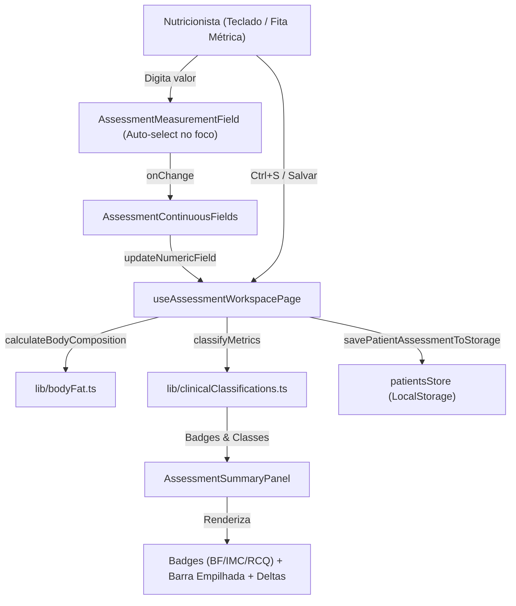

# Implementation Plan: Melhorias de UI/UX na Tela de Avaliação Física

**Branch**: `20-08-26-melhorias-ui-ux-avaliacao-fisica` | **Date**: 2026-08-20 | **Spec**: [spec.md](./spec.md)

**Input**: Feature specification from `specs/20-08-26-melhorias-ui-ux-avaliacao-fisica/spec.md`

## Summary

Implementação do pacote de refinamento ergonômico e clínico na tela dedicada de avaliação física (`/pacientes/[id]/avaliacao/[assessmentId]`), composto por:
1. **Entrada de dados otimizada**: auto-seleção de texto no foco (`onFocus`), atalho global `Ctrl+S` / `Cmd+S` e valores anteriores com deltas inline em cada input numérico.
2. **Diagnóstico clínico reativo**: classificações semânticas categorizadas para BF% (Jackson/Pollock), IMC (OMS) e RCQ (Bray & Gray).
3. **Distribuição corporal gráfica**: barra visual empilhada de proporção entre massa magra e massa gorda.
4. **Segurança e agilidade**: proteção contra saída acidental com alterações pendentes (*dirty form guard*) e botão de copiar resumo para WhatsApp/prontuário.

---

## Technical Context

**Language/Version**: TypeScript 5.7+ / React 19 / Next.js 15 App Router  
**Primary Dependencies**: Lucide React, Sonner (Toasts), Tailwind CSS, Radix UI Primitives  
**Storage**: LocalStorage (`nutridiet_assessments_<id>` via `patientsStore.ts`)  
**Testing**: Vitest 4.1+ / Testing Library  
**Target Platform**: Desktop Web (`>= 1024px`)  
**Project Type**: Single-page client-rendered medical productivity workspace  
**Performance Goals**: Renderização reativa de cálculos e classificações em <50ms após `onChange`  
**Constraints**: 100% de conformidade com Atomic Design e Design System canônico  

---

## Constitution Check

| Princípio Constitucional | Status | Justificativa |
| :--- | :---: | :--- |
| **I. Atomic Design Architecture** | ✅ PASS | Componentes organizados estritamente em `atoms` (`Badge`), `molecules` (`AssessmentMeasurementField`), `organisms` (`AssessmentSummaryPanel`), `hooks` e `app`. Primitives em `src/components/ui` intocados. |
| **II. Canonical Design System** | ✅ PASS | Consumo exclusivo de tokens do Design System (`Surface`, `MetricBox`, `textStyle`, `BadgeTone`, cores semânticas). |
| **III. Desktop Scope and Accessibility** | ✅ PASS | Escopo desktop `>= 1024px`, atalhos de teclado documentados (`Ctrl+S`, `Tab`), atributos ARIA (`role="alert"`, `aria-label`) e foco visível. |
| **IV. Test-First Quality** | ✅ PASS | Cobertura com testes unitários em `tests/` para as funções de classificação clínica e componentes do workspace. |

---

## Project Structure

### Documentation (this feature)

```text
specs/20-08-26-melhorias-ui-ux-avaliacao-fisica/
├── spec.md
├── checklists/
│   └── requirements.md
├── plan.md
└── tasks.md
```

### Source Code Changes

```text
src/
├── lib/
│   └── clinicalClassifications.ts           # [NEW] Utilitário de classificação clínica de BF%, IMC e RCQ
├── hooks/
│   └── useAssessmentWorkspacePage.ts        # [MODIFY] Atalho Ctrl+S, dirty state tracking e cópia de resumo
├── components/
│   ├── molecules/
│   │   └── assessment/
│   │       ├── AssessmentMeasurementField.tsx # [MODIFY] Auto-select no foco e exibição de valor anterior inline
│   │       └── AssessmentContinuousFields.tsx # [MODIFY] Passagem de dados anteriores e renderização de deltas
│   └── organisms/
│       └── assessment/
│           └── AssessmentSummaryPanel.tsx   # [MODIFY] Badges clínicos, barra gráfica empilhada e botão copiar
└── app/
    └── pacientes/
        └── [id]/
            └── avaliacao/
                └── [assessmentId]/
                    └── page.tsx             # [MODIFY] Integração de dirty guard e alerta de saída
tests/
├── lib/
│   └── clinicalClassifications.test.ts      # [NEW] Testes das tabelas de classificação clínica
└── app/
    └── pacientes/
        └── assessment-workspace.test.tsx    # [MODIFY] Testes de auto-select, deltas inline, Ctrl+S e badges
```

---

## Architecture & Data Flow


