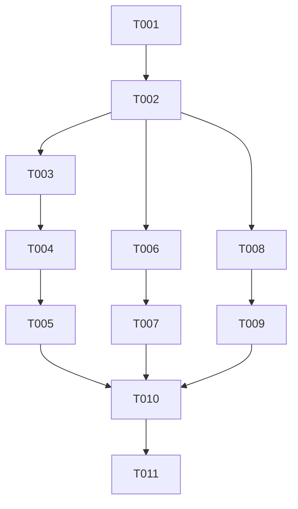

# Tasks: Modularização da Barra de Proporção de Macronutrientes

**Feature**: Modularização da Barra de Proporção de Macronutrientes e Distribuição Calórica (% VET)  
**Spec**: [spec.md](./spec.md) | **Plan**: [plan.md](./plan.md)

## Phase 1: Setup & Foundations

- [x] T001 [skill: frontend-architecture-mindset] Atualizar o contrato e interface `MacroProportionBarProps` em `src/components/molecules/MacroProportionBar.tsx` para suportar `title`, `showTotalPct`, `showKcalPerMacro`, `showGrams`, `showPct` e `emptyMessage`.
- [x] T002 [skill: ui-ux-pro-max] Implementar suporte a header de título opcional, renderização condicional de kcal por macro e layout flexível em `src/components/molecules/MacroProportionBar.tsx`.

## Phase 2: User Story 1 - Distribuição Calórica no Modal de Ajustar Metas (Priority: P1)

- [x] T003 [P] [US1] [skill: tdd] Criar testes unitários para as novas propriedades (`title`, `showKcalPerMacro`, `emptyMessage`) em `tests/components/molecules/macro-proportion-bar.test.tsx`.
- [x] T004 [US1] [skill: nextjs-fullstack-master] Refatorar `src/components/molecules/AdjustDietGoalsModal.tsx` substituindo o bloco de JSX hardcoded pela molécula `<MacroProportionBar />`.
- [x] T005 [US1] [skill: tdd] Executar e validar a suíte de testes de `tests/components/molecules/adjust-diet-goals-modal.test.tsx`.

## Phase 3: User Story 2 - Proporção de Macros nos Cards de Refeição (Priority: P1)

- [x] T006 [US2] [skill: frontend-architecture-mindset] Validar a integração e ordenação canônica da `MacroProportionBar` em `src/components/organisms/MealCardContainer.tsx`.
- [x] T007 [US2] [skill: tdd] Executar e validar testes de renderização de superfícies em `tests/components/organisms/surface-consumers.test.tsx`.

## Phase 4: User Story 3 - Documentação e Reuso Instantâneo (Priority: P2)

- [x] T008 [P] [US3] [skill: ui-ux-pro-max] Documentar o componente `macro-proportion-bar` no Design System em `design-system/components/profiles/molecules/macro-proportion-bar.md`.
- [x] T009 [US3] [skill: frontend-architecture-mindset] Atualizar o registro do Design System em `design-system/components/registry.json`.

## Phase 5: Polish & Regression Tests

- [x] T010 [skill: tdd] Executar a suíte de testes completa do domínio de dietas e moléculas para garantir regressão zero.
- [x] T011 [skill: code-reviewer-expert] Executar auditoria de conformidade com a Constituição e padrões do Design System.

## Dependencies & Completion Order

