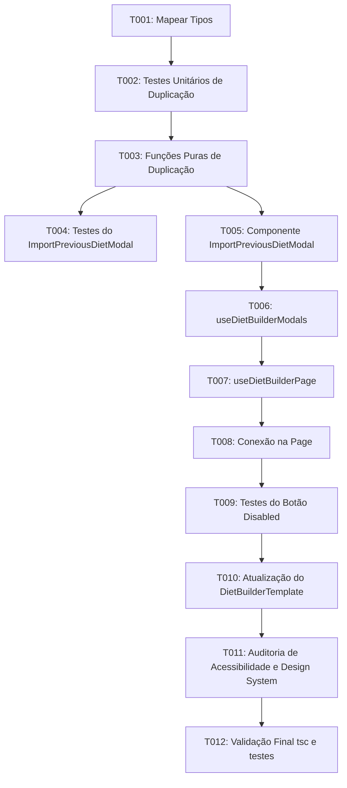

# Tasks: Refatoração do botão Puxar Metas Anteriores com Modal de Seleção de Dietas

**Input**: Design documents from `/specs/26-08-26-refatorar-puxar-dietas-anteriores/`

**Prerequisites**: `plan.md`, `spec.md`, `research.md`, `data-model.md`, `quickstart.md`

**Organization**: Tasks are grouped by user story so each increment can be implemented and validated independently.

## Phase 1: Setup (Shared Infrastructure)

**Purpose**: Preparar utilitários e contratos de dados para dietas anteriores e duplicação.

- [ ] T001 [skill: $nextjs-fullstack-master] Mapear tipos `PreviousDietSummary`, `ImportActionType` e contratos de props em `src/lib/dietDuplication.ts` conforme `specs/26-08-26-refatorar-puxar-dietas-anteriores/data-model.md`.

## Phase 2: Foundational (Blocking Prerequisites)

**Purpose**: Criar as funções puras de formatação de resumo, clonagem profunda de refeições e isolamento de estado.

- [ ] T002 [skill: $tdd] [P] Criar testes unitários determinísticos em `tests/lib/dietDuplication.test.ts` para as funções `buildPreviousDietSummaries`, `cloneMealsWithFreshIds` e `cloneDietForNewDraft`.
- [ ] T003 [skill: $tdd] Implementar funções utilitárias puras `buildPreviousDietSummaries`, `cloneMealsWithFreshIds` e `cloneDietForNewDraft` em `src/lib/dietDuplication.ts`, fazendo os testes T002 passarem com 100% de integridade e novos IDs únicos para refeições e itens.

**Checkpoint**: Utilitários de duplicação prontos e testados com cobertura unitária; implementação do modal e da UI pode prosseguir.

## Phase 3: User Story 1 & 2 - Modal de Seleção e Ações de Importação (Priority: P1) 🎯 MVP

**Goal**: Exibir modal com tabela de dietas anteriores permitindo selecionar uma dieta e escolher entre puxar apenas macros ou puxar todas as refeições para a nova dieta.

**Independent Test**: Abrir `/dieta/nova` para um paciente com dietas anteriores, abrir o modal, selecionar uma dieta e testar separadamente: (a) Puxar apenas macros atualiza metas sem alterar refeições; (b) Puxar todas as refeições duplica alimentos e refeições com IDs únicos sem modificar a dieta original.

### Tests for User Story 1 & 2

- [ ] T004 [skill: $tdd] [P] [US1] Criar testes de componente em `tests/components/molecules/ImportPreviousDietModal.test.tsx` cobrindo renderização da tabela, ordenação de datas, seleção de linha, botões desabilitados na ausência de seleção e disparo de callbacks com a dieta selecionada.

### Implementation for User Story 1 & 2

- [ ] T005 [skill: $frontend-design] [US1] Criar o componente `src/components/molecules/ImportPreviousDietModal.tsx` com `Dialog`, tabela estruturada (Data, Nome, Modo, Calorias, Macros, Qtd. Refeições), estado de seleção exclusiva de linha e dois botões de ação ("Puxar apenas os macros" e "Puxar todas as refeições"), exportando em `src/components/molecules/index.ts`.
- [ ] T006 [skill: $frontend-architecture-mindset] [US1] Atualizar `src/hooks/useDietBuilderModals.ts` para incluir estado do modal `isImportPreviousDietModalOpen`, `setIsImportPreviousDietModalOpen` e sincronização de dados.
- [ ] T007 [skill: $nextjs-fullstack-master] [US1] Atualizar `src/hooks/useDietBuilderPage.ts` para carregar dietas anteriores formatadas (filtrando `'nova'` e a dieta atual), implementar `handlePullMacrosOnly` e `handlePullAllMeals` com emissão de toasts de sucesso e isolamento de estado.
- [ ] T008 [skill: $nextjs-fullstack-master] [US1] Integrar `ImportPreviousDietModal` na página `src/app/pacientes/[id]/dieta/[dietaId]/page.tsx`, conectando propriedades, estados e callbacks.

**Checkpoint**: US1 e US2 funcionais - nutricionista consegue selecionar qualquer dieta anterior e escolher se puxa macros ou a estrutura de refeições completa.

## Phase 4: User Story 3 - Estado Desabilitado quando Não Há Dietas Anteriores (Priority: P2)

**Goal**: Garantir que o botão na barra de ações de metas esteja desabilitado quando o paciente não tiver histórico de dietas.

**Independent Test**: Acessar `/dieta/nova` para um paciente sem histórico prévio e confirmar que o botão está inativo (`disabled`) com tooltip informativo.

### Tests for User Story 3

- [ ] T009 [skill: $tdd] [P] [US3] Criar testes de renderização e estado `disabled` para o botão de puxar dietas anteriores em `tests/components/templates/DietBuilderTemplate.test.tsx`.

### Implementation for User Story 3

- [ ] T010 [skill: $frontend-design] [US3] Atualizar `src/components/templates/dietBuilderTemplateTypes.ts` e `src/components/templates/DietBuilderTemplate.tsx` para aceitar `hasPreviousDiets` e `onOpenImportPreviousDietModal`, renderizando o botão com `disabled={!hasPreviousDiets}` e tooltip explicativo.

**Checkpoint**: US3 funcional - botão inativo e protegido contra cliques em pacientes novos sem histórico.

## Phase 5: Polish & Quality Assurance

**Purpose**: Assegurar acessibilidade, conformidade visual do design system e ausência de regressões.

- [ ] T011 [skill: $code-reviewer-expert] [P] Auditar conformidade de acessibilidade desktop WCAG 2.2 AA (foco visível, navegação por teclado com Tab/Escape/Enter e aria-labels) em `ImportPreviousDietModal.tsx` e `DietBuilderTemplate.tsx`.
- [ ] T012 [skill: $nextjs-fullstack-master] Executar checagem de tipos (`npx tsc --noEmit`) e suíte completa de testes (`npm run test`), validando que todos os cenários passam sem quebras.

## Dependencies & Execution Order

