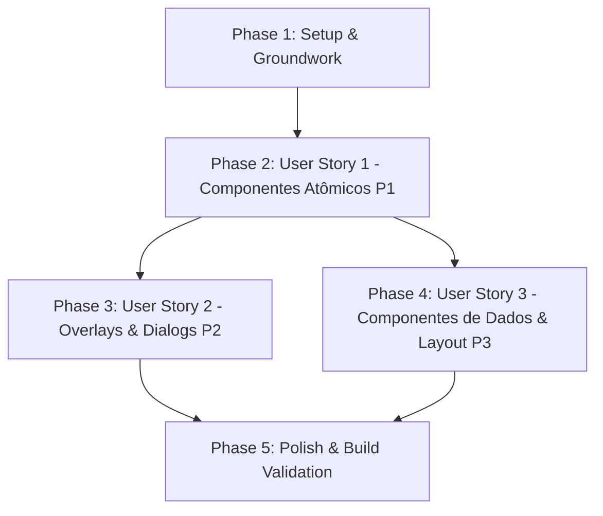

# Tasks: Adequação dos Componentes Shadcn ao Design System NutriDiet

**Feature**: `specs/29-07-26-adequar-componentes-do-shadcn-ao-design-system-nutridiet`
**Spec**: [spec.md](file:///c:/Programmer/diet-maker/specs/29-07-26-adequar-componentes-do-shadcn-ao-design-system-nutridiet/spec.md)
**Plan**: [plan.md](file:///c:/Programmer/diet-maker/specs/29-07-26-adequar-componentes-do-shadcn-ao-design-system-nutridiet/plan.md)

## Dependency Graph & Story Order

---

## Phase 1: Setup & Groundwork

- [ ] T001 [skill: frontend-design] Validar e confirmar configurações de tokens semânticos `warm-*` e estendidos em `tailwind.config.js` e `src/app/globals.css`.

---

## Phase 2: User Story 1 - Componentes Atômicos de Interface (Priority: P1)

**Goal**: Refatorar os componentes atômicos (`button`, `badge`, `input`, `card`, `separator`) aplicando raio `rounded-xl` / `rounded-2xl` / `rounded-full`, cores `warm-*` e zero `box-shadow`.

- [ ] T002 [skill: shadcn] [P] [US1] Refatorar `Button` em `src/components/ui/button.tsx` aplicando variações `warm-*`, `rounded-xl`, zero sombras e variante `emerald`.
- [ ] T003 [skill: shadcn] [P] [US1] Refatorar `Badge` em `src/components/ui/badge.tsx` aplicando `rounded-full`, zero sombras e variantes semânticas de macronutrientes (`kcal`, `protein`, `carb`, `fat`).
- [ ] T004 [skill: shadcn] [P] [US1] Refatorar `Input` em `src/components/ui/input.tsx` aplicando `rounded-xl`, bordas `border-warm-border` e foco `ring-warm-borderDark`.
- [ ] T005 [skill: shadcn] [P] [US1] Refatorar `Card` (e subcomponentes) em `src/components/ui/card.tsx` aplicando `rounded-2xl`, fundo `bg-warm-card`, borda `border-warm-border`, zero `shadow` e tipografia `font-display`.
- [ ] T006 [skill: shadcn] [P] [US1] Refatorar `Separator` em `src/components/ui/separator.tsx` alinhando cor com `bg-warm-border`.

---

## Phase 3: User Story 2 - Componentes Overlay & Dialogs (Priority: P2)

**Goal**: Refatorar os componentes de sobreposição (`dialog`, `sheet`, `dropdown-menu`, `popover`, `tooltip`) aplicando superfícies `bg-warm-card`, contornos `border-warm-border` e ausência de sombras.

- [ ] T007 [skill: shadcn] [P] [US2] Refatorar `Dialog` em `src/components/ui/dialog.tsx` ajustando container para `rounded-2xl`, `border-warm-border`, `shadow-none` e backdrop.
- [ ] T008 [skill: shadcn] [P] [US2] Refatorar `Sheet` em `src/components/ui/sheet.tsx` ajustando painéis laterais com borda e cores NutriDiet.
- [ ] T009 [skill: shadcn] [P] [US2] Refatorar `DropdownMenu` em `src/components/ui/dropdown-menu.tsx` aplicando `rounded-xl`, fundo `bg-warm-card` e hover `bg-warm-inner`.
- [ ] T010 [skill: shadcn] [P] [US2] Refatorar `Popover` em `src/components/ui/popover.tsx` aplicando `rounded-xl`, `border-warm-border` e zero sombra.
- [ ] T011 [skill: shadcn] [P] [US2] Refatorar `Tooltip` em `src/components/ui/tooltip.tsx` ajustando superfície com cores e cantos `rounded-xl` do NutriDiet.

---

## Phase 4: User Story 3 - Componentes de Dados e Layout (Priority: P3)

**Goal**: Refatorar os componentes de exibição de dados e navegação (`table`, `tabs`, `scroll-area`, `select`) para estarem 100% integrados às diretrizes estéticas.

- [ ] T012 [skill: shadcn] [P] [US3] Refatorar `Tabs` em `src/components/ui/tabs.tsx` ajustando `TabsList` para `bg-warm-inner` com `rounded-xl` e `TabsTrigger` ativo em `bg-warm-card`.
- [ ] T013 [skill: shadcn] [P] [US3] Refatorar `Table` em `src/components/ui/table.tsx` alinhando bordas com `border-warm-border` e estados hover das linhas.
- [ ] T014 [skill: shadcn] [P] [US3] Refatorar `Select` em `src/components/ui/select.tsx` aplicando `rounded-xl`, bordas `border-warm-border` e menu dropdown alinhado.
- [ ] T015 [skill: shadcn] [P] [US3] Refatorar `ScrollArea` em `src/components/ui/scroll-area.tsx` ajustando a barra de rolagem para tons sutis da paleta `warm-*`.

---

## Phase 5: Polish & Validation

- [ ] T016 [skill: ui-ux-pro-max] Executar build de produção (`npm run build`) para validar compilação limpa de todos os 14 componentes refatorados.
- [ ] T017 [skill: frontend-design] Auditar a aderência completa de todos os 14 componentes às regras invioláveis de Swiss Flat Design (zero sombras, zero gradientes, WCAG AA).
