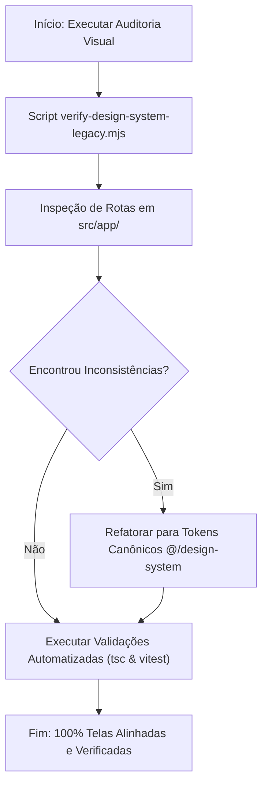

# Implementation Plan - Análise de Inconsistências do Design System em Todas as Telas

**User Specs Input**: `specs/31-07-26-analise-inconsistencias-design-system/spec.md`  
**Feature Dir**: `specs/31-07-26-analise-inconsistencias-design-system`  
**Branch**: `31-07-26-analise-inconsistencias-design-system`  
**Created**: 2026-07-31

## Technical Context

- **Framework**: Next.js App Router (React 19, TypeScript)
- **Styling**: Tailwind CSS + `@/design-system` (Tokens, Recipes e Text Styles)
- **Single Source of Truth**: `design-system-guidelines/`
- **Testing**: Vitest (`npx vitest run`), `npx tsc --noEmit`, `node scripts/verify-design-system-legacy.mjs`

## Constitution Check

- **Principle 1**: `design-system-guidelines/` é a única autoridade documental e contratual do Design System.
- **Principle 2**: Tipografia de botões deve ser `font-semibold` (`button-label` ou `button-label-compact`) sem overrides arbitrários (`font-black`, `font-bold`, `text-xs font-bold`).
- **Principle 3**: Superfícies e cartões devem utilizar os tokens de cores semânticas (`bg-surface`, `border-border-subtle`, `text-text-primary`).
- **Principle 4**: Viewport primário é Desktop (>= 1024px); utilitários móbiles (`md:`, `sm:`) devem ser evitados em telas desktop-first.

## Design Phase Artifacts

- **Research Document**: `specs/31-07-26-analise-inconsistencias-design-system/research.md`
- **Data Model / Entity Schema**: `specs/31-07-26-analise-inconsistencias-design-system/data-model.md`
- **Quickstart Guide**: `specs/31-07-26-analise-inconsistencias-design-system/quickstart.md`

## Proposed Architectural Flow

