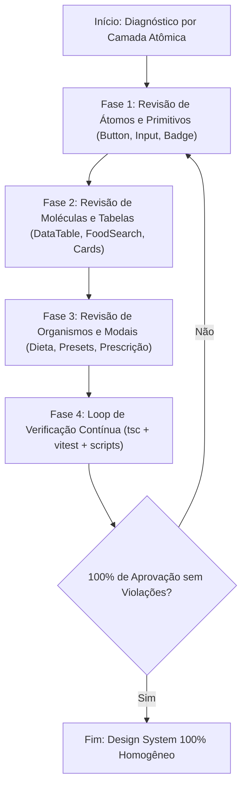

# Implementation Plan - Revisão Completa dos Componentes e Aplicação do Design System

**User Specs Input**: `specs/31-07-26-revisao-componentes-design-system/spec.md`  
**Feature Dir**: `specs/31-07-26-revisao-componentes-design-system`  
**Branch**: `31-07-26-revisao-componentes-design-system`  
**Created**: 2026-07-31

## Technical Context

- **Framework**: Next.js App Router (React 19, TypeScript)
- **Styling**: Tailwind CSS + `@/design-system` (Tokens, Recipes, Text Styles)
- **Single Source of Truth**: `design-system-guidelines/`
- **Testing**: Vitest (`npx vitest run`), TypeScript (`npx tsc --noEmit`), Scripts de auditoria estática (`verify-design-system-legacy.mjs` e `audit-atomic-design.mjs`)

## Constitution Check

- **Principle 1**: `design-system-guidelines/` é a fonte única e absoluta de verdade para todas as regras de design.
- **Principle 2**: Tabelas devem possuir estilo unificado (`border-border-subtle`, `bg-surface-subtle` no `thead`, `text-text-muted`, hover em `bg-surface-hover`).
- **Principle 3**: Tipografia de botões deve ser `font-semibold` (`button-label` ou `button-label-compact`), eliminando `font-bold` e `font-black` ad-hoc.
- **Principle 4**: Textos e rótulos de telas devem consumir text styles e tokens cromáticos autorizados (`text-text-primary`, `text-text-secondary`, `text-text-muted`).

## Design Phase Artifacts

- **Research Document**: `specs/31-07-26-revisao-componentes-design-system/research.md`
- **Data Model / Entity Schema**: `specs/31-07-26-revisao-componentes-design-system/data-model.md`
- **Quickstart Guide**: `specs/31-07-26-revisao-componentes-design-system/quickstart.md`

## Proposed Architectural Flow

